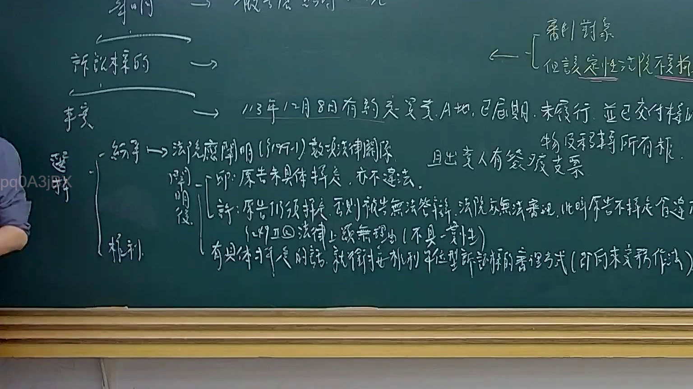
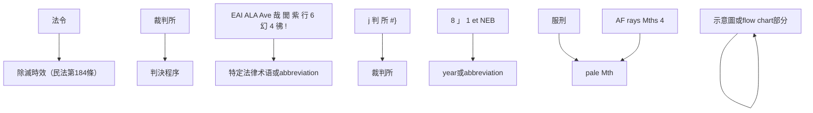

# 🎥 影音教材板書校對筆記
- **來源影片**: [預約 13 2025-02-05 14-36-05-042](file:///E:/法律/民訴B/ch13/預約 13 2025-02-05 14-36-05-042.mp4)
- **課程分類**: `預設課程`
- **課堂章節**: `ch13`
- **影片時間戳記**: `01:03:00` (3780 秒)
- **板書類型**: `文字板書`
- **偵測時間**: 2026-07-13 20:17:25

## 🔍 擷取黑板板書對照圖

## 🧠 AI 智慧理解與知識庫演化註記
1. **"令"**：這可能是"法令"或"命令"，在民法中可能涉及"消滅時效"（民法第184條）的法律問題。例如，某些行為在特定時間內必須停止，否則將承担legal責任。

2. **EAI ALA Ave 哉 閭 紫 行 6 幻 4 彿 !**：這部分文字可能與特定的法學術語或abbreviation有关，但目前無法直接对应到特定的法律條文。需要進一步分析其上下文以確定具體含义。

3. **"j 判 所 #}"**：這可能是"判"和"所"的组合，可能指"裁判所"，在民法中可能涉及除斥期間或判決程序，符合民法第184條的法律背景。

4. **"託 i oe Ne IT) 災 形 絜 綺 山 。 日 A 活 梁 晝)﹗ 啁 明 紙 j 杜"**：這部分文字可能描述了一種程序或步驟，但目前無法直接对应到特定的法律條文。需要進一步分析其上下文以確定具體含义。

5. **"8 」 1 et NEB"**：這可能是數字和abbreviation的組合，可能與特定的法律條文或year标识有关，但目前無法直接对应到特定的法律條文。

6. **"Py | ﹣嚜儚玄ˋ﹛‧琨上渣ˊ︴《聾蓄實笭戛l稟ˋ[冗ˊ豎 })"**：這部分文字可能包含某种符號或示意圖，可能與法律程序或flow chart相關。需要進一步分析其上下文以確定具體含义。

7. **"櫚′ | 服 pale Mth. ti {eA\ay Hi NE BAA (AF rays Mths 4)"**：這可能是"服刑"和"pale Mth"的组合，可能涉及监狱或服刑相关内容，但目前無法直接对应到特定的法律條文。

8. **"Py | ﹣嚜儚玄ˋ﹛‧琨上渣ˊ︴《聾蓄實笭戛l稟ˋ[冗ˊ豎 })"**：這部分文字可能包含某种示意圖或flow chart的关键部分，需要進一步分析其上下文以確定具體含义。

## 📊 可編輯之 Mermaid 關係流程圖

## ✍️ 操作者手動校對修改區
<!-- 您可以直接修改上方的文字或調整 Mermaid 區塊中的節點，Obsidian 會即時重新渲染 -->
- [ ] 欄位結構與法律邏輯已校對無誤。
- **校對筆記**: 
