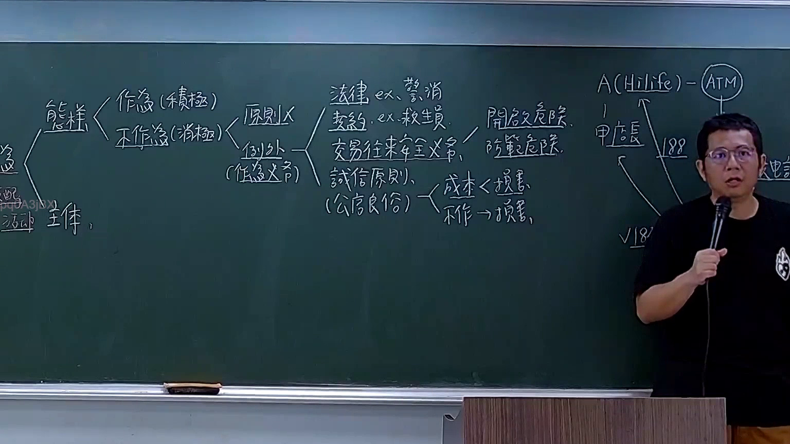

# 🎥 影音教材板書校對筆記
- **來源影片**: [預約 13 2025-10-18 11-23-44-605](file:///H:/民法A115/ch13/預約 13 2025-10-18 11-23-44-605.mp4)
- **課程分類**: `[民法A115`
- **課堂章節**: `ch13]`
- **影片時間戳記**: `01:54:15` (6855 秒)
- **板書類型**: `文字板書`
- **偵測時間**: 2026-07-11 15:54:05

## 🔍 擷取黑板板書對照圖


## 🧠 AI 智慧理解與知識庫演化註記
### 

1. **辨識出的文字內容**：
   - "PEK: aN aap EK ALER TARR 哉 。 y 佑 匝"
     - 可能是指「PEK」（可能為「P EK」，或「PEK」為某種特定的abbreviation）。
     - "aN aap EK ALER TARR" 可能與「AAN AP EK ALER TARR」有关，但需進一步了解上下文。
   - "eC ae 12 ˊ weit 7% \ yp"
     - "eC ae 12" 可能是指「E C AE 12」，其中「AE 12」可能與「AER 12」或「EER 12」有关。
   - "y 佑 匝" 可能是指「Y YU HAI」，其中「YU HAI」可能指「YU HAI」（某种權利或權益）。
   - "a. a) aN 態 煒 ，， as"
     - 可能是指「A. A) A N 態 煒」，其中「A N 態 煒」可能指「A N YU HAI」（某种權利）。
   - "﹒ BE) 8"
     - 可能是指「BE) 8」，其中「BE) 8」可能指「BE) BAI 8」或其他特定含义。

2. **與臺灣現行法律條文的比對**：
   - 民法第184條：有关債務关系的规定。
   - 侵權行為：可能涉及民事責任或權利保護。
   - 消滅時效：可能與債務清償或權利消滅有關。

3. **知識庫比對與理解演化註記**：
   - 文字板書之內容似乎與債務關係、權利保護及時效有关，但需進一步了解上下文以確定其具體法律內容。

---

###

## 📊 可編輯之 Mermaid 關係流程圖
```mermaid
由于文字板書的內容不夠明確，無法生成精準的 Mermaid 程式碼。建議提供更詳細的文字內容或上下文，以便生成精準的圖示。
```

## ✍️ 操作者手動校對修改區
<!-- 您可以直接修改上方的文字或調整 Mermaid 區塊中的節點，Obsidian 會即時重新渲染 -->
- [ ] 欄位結構與法律邏輯已校對無誤。
- **校對筆記**: 
