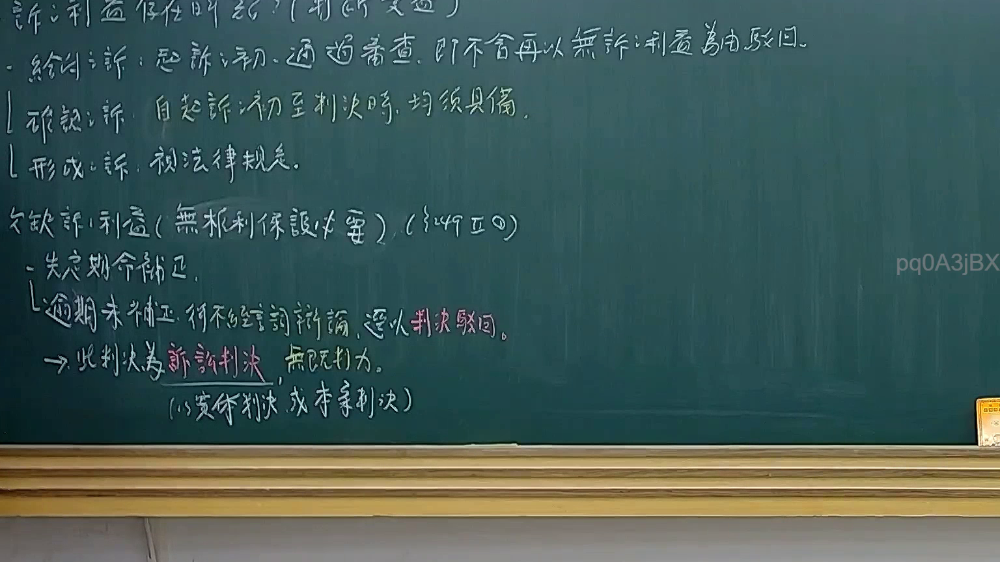
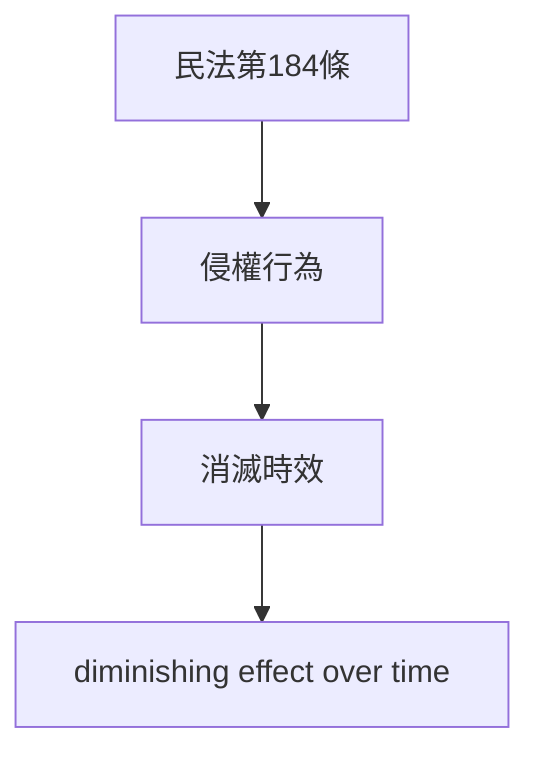

# 🎥 影音教材板書校對筆記
- **來源影片**: [預約 14 2025-02-05 17-15-37-924](file:///E:/法律/民訴B/ch14/預約 14 2025-02-05 17-15-37-924.mp4)
- **課程分類**: `預設課程`
- **課堂章節**: `ch14`
- **影片時間戳記**: `00:12:15` (735 秒)
- **板書類型**: `文字板書`
- **偵測時間**: 2026-07-13 20:21:57

## 🔍 擷取黑板板書對照圖


## 🧠 AI 智慧理解與知識庫演化註記
### 

这段板書似乎涉及民法第184條（侵權行為、消滅時效等）的內容。以下是對比與理解：

- **民法第184條**：該條文规定，對於侵權行為，其效用會随着時間的流逝而漸漸消失。
- **消灭时效**：此概念用於表明侵權行為的影響會隨著時間推移而减弱或消失。
- **侵權行為**：涉及對他人權利的損害，例如物权、人格权等。

###

## 📊 可編輯之 Mermaid 關係流程圖


此圖表表明了民法第184條與侵權行為、消滅时效之間的邏輯關係，即民法第184條规定了侵權行為的特性，而消滅时效則描述了其影響随時間推移而减弱或消失的現象。
```

## ✍️ 操作者手動校對修改區
<!-- 您可以直接修改上方的文字或調整 Mermaid 區塊中的節點，Obsidian 會即時重新渲染 -->
- [ ] 欄位結構與法律邏輯已校對無誤。
- **校對筆記**: 
