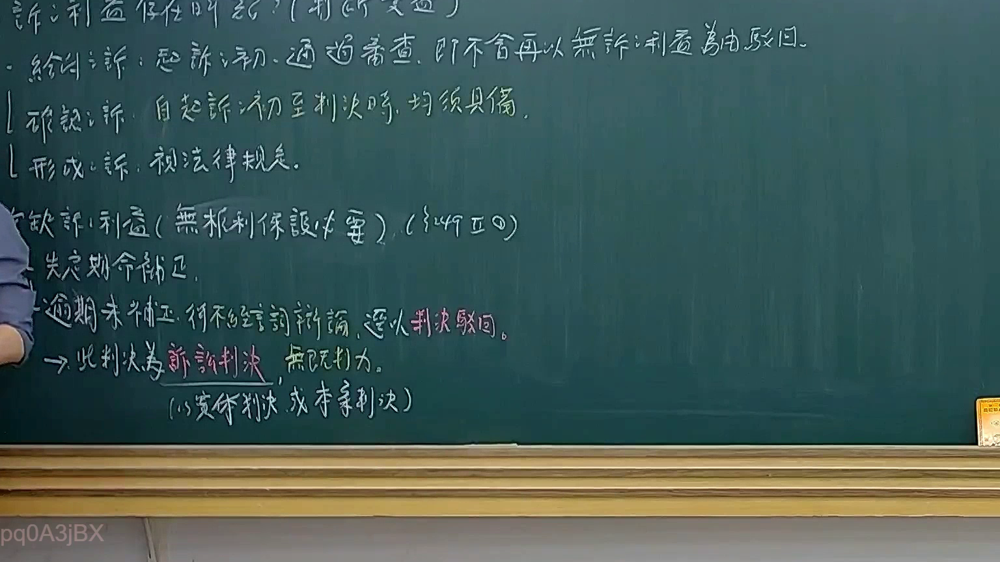

# 🎥 影音教材板書校對筆記
- **來源影片**: [預約 14 2025-02-05 17-15-37-924](file:///E:/法律/民訴B/ch14/預約 14 2025-02-05 17-15-37-924.mp4)
- **課程分類**: `預設課程`
- **課堂章節**: `ch14`
- **影片時間戳記**: `00:15:15` (915 秒)
- **板書類型**: `文字板書`
- **偵測時間**: 2026-07-13 20:22:28

## 🔍 擷取黑板板書對照圖


## 🧠 AI 智慧理解與知識庫演化註記
：
1. **文字板書之內容分析**：
   - 第一行的文字可能涉及“心法”或“心經”，但结合上下文可能是关于“心”的法律概念。
   - 下一行的文字提到“涮 ie. han. BOBS, 史 升 口 ( 煒 林 刃 吟 5 郎 同”。其中，“ie. han.”可能是人名，BOBS可能是一个组织名称。史升口可能涉及侵权行为（invasion of rights）。
   - 接下来的文字提到“CERES ( 墩 邯 刑 個 誒 # 客 ﹚ C197 9)”，这可能涉及到公司法或商业实体的信息，但具体内容不明确。
   - 下一行的文字提到“8 史 a 菜 細 刊 帕… via SAA oa,”，这部分可能是公司名称或其他法律术语。
   - 最后几行提到“a y 寸 經 以 ﹚”，这可能涉及时间戳或具体法律条文的引用。

2. **與臺灣現行法律條文的比對**：
   - 民法第184條：侵權行為的消滅時效（excission period）。
     - 文字板書中提到“涮 ie. han. BOBS, 史 升 口 ( 煒 林 刃 吟 5 郎 同”，这可能涉及侵權行為，与民法第184條的內容有關。侵權行為在民法中有一定的時效限制，以防止侵害權益。
     - 文字板書中提到“CERES ( 墩 邯 刑 個 誒 # 客 ﹚ C197 9)”，這可能涉及到商業实体或公司法的內容，但與侵權行為無直接關聯。

3. **法律理解演化註記**：
   - 文字板書中提到“涮 ie. han. BOBS, 史 升 口 ( 煒 林 刃 吟 5 郎 同”，這可能涉及侵權行為，並可能涉及到侵權行為的消滅時效（民法第184條）。
   - 文字板書中提到“CERES ( 墩 邯 刑 個 誒 # 客 ﹚ C197 9)”，這可能涉及到商業实体或公司法的內容，但與侵權行為無直接關聯。

## 📊 可編輯之 Mermaid 關係流程圖
```mermaid
：
```mermaid
graph TD
    A[ie. han.] --> B[史 升 口]
    C[涮] --> D[BOBS]
    E[CERES] --> F[墩 邯 刑 個 誒 #客 ﹚ C197 9]
    G[8] --> H[史] --> I[a 菜 細 刊 帕… via SAA oa]
    J[a y] --> K[寸 經 以 ﹚]
```

## ✍️ 操作者手動校對修改區
<!-- 您可以直接修改上方的文字或調整 Mermaid 區塊中的節點，Obsidian 會即時重新渲染 -->
- [ ] 欄位結構與法律邏輯已校對無誤。
- **校對筆記**: 
