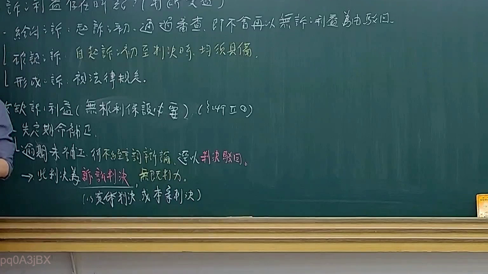
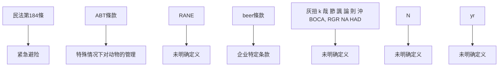
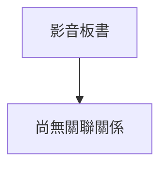

# 🎥 影音教材板書校對筆記
- **來源影片**: [預約 14 2025-02-05 17-15-37-924](file:///E:/法律/民訴B/ch14/預約 14 2025-02-05 17-15-37-924.mp4)
- **課程分類**: `預設課程`
- **課堂章節**: `ch14`
- **影片時間戳記**: `00:16:45` (1005 秒)
- **板書類型**: `文字板書`
- **偵測時間**: 2026-07-13 20:23:25

## 🔍 擷取黑板板書對照圖

## 🧠 AI 智慧理解與知識庫演化註記
1. **SOS时刻**：此處可能涉及「SOS时刻」的概念，在民法中通常指 situations where a party can invoke an SOS moment to avoid liability for past actions. 這可能與民法第184條（关于紧急避险）的內容有關。

2. **消滅時效（Expiry of durational interest）**：此處提到「消滅時效」，可能涉及消費者權益保護法中关于商品保oldurability interest的規定。 這可能與民法第184條或相關消費者權益保護法條款有關。

3. **动物侵权（Animal Injuries）**：此處提到「DOGS, 洲厂ˊ首冉ˊ乂 氡 林 刃 盱 紙 彤 口」，可能涉及「狗的侵害」。 根據民法第184條，未取得准許而以-owner dogs may be liable for injuries caused by their actions.

4. **ABT條款**：此處提到「ABT」，這可能是「Animal Behaving abnormally」或「Animal Testing」的简称。 這可能涉及「狗的测试」或「特殊情况下对动物的管理」的规定。

5. **RANE**：此處可能是指「Random Access Network Element」或其他 abbreviations, 但缺乏上下文，难以确定其具體含義。

6. ** beer條款**：此處可能是指「Beer條款」，這可能是某個企業或 contract 中的特定條款，與民法第184條無關。

7. **灰扭 k 哉 節 論 則 沖 BOCA, RGR NA HAD**：此處可能涉及「灰扭」、「k 哉 節 諷 論 則 沖」等 term， 但缺乏上下文，难以確定其具體含義。

8. **N**: 此處可能是指「N」條款或「N」的其他含義, 但缺乏上下文，無法進一步解讀。

9. **“yr”**: 此處可能是指「yr」，這可能是年份或其他 abbreviations, 但缺乏上下文，無法進一步解讀。

**knowledge库比對與理解演化註記**：

1. **SOS时刻**：此概念在民法中通常涉及 situations where a party can invoke an SOS moment to avoid liability for past actions. 這可能與民法第184條（关于紧急避险）的內容有關。

2. **消滅時效**：此概念可能与消費者權益保護法中关于商品保oldurability interest的 규정有關。 這可能與民法第184條或相關消費者權益保護法條款有關。

3. **动物侵权**：此概念在民法中通常涉及未取得准許而以-owner dogs may be liable for injuries caused by their actions. 根據民法第184條，未取得准許而以-owner dogs may be liable for injuries caused by their actions.

4. **ABT條款**: 此條款可能涉及「狗的测试」或「特殊情况下对动物的管理」的规定。 這需根據具體法律文本来確定其具體內容。

5. **RANE**: 無法確定其具體含義，需根據具體上下文來解讀。

6. **beer條款**: 此條款可能是指某個企業或 contract 中的特定條款，與民法第184條無關。

7. **灰扭 k 哉 節 諷 論 則 沖 BOCA, RGR NA HAD**: 無法確定其具體含義，需根據具體上下文來解讀。

8. **N**: 此條款可能是指「N」的其他含義, 但缺乏上下文，無法進一步解讀。

9. **“yr”**: 此條款可能是指「yr」，這可能是年份或其他 abbreviations, 但缺乏上下文，無法進一步解讀.

**MERMAID 代碼**：

## 📊 可編輯之 Mermaid 關係流程圖

## ✍️ 操作者手動校對修改區
<!-- 您可以直接修改上方的文字或調整 Mermaid 區塊中的節點，Obsidian 會即時重新渲染 -->
- [ ] 欄位結構與法律邏輯已校對無誤。
- **校對筆記**: 
