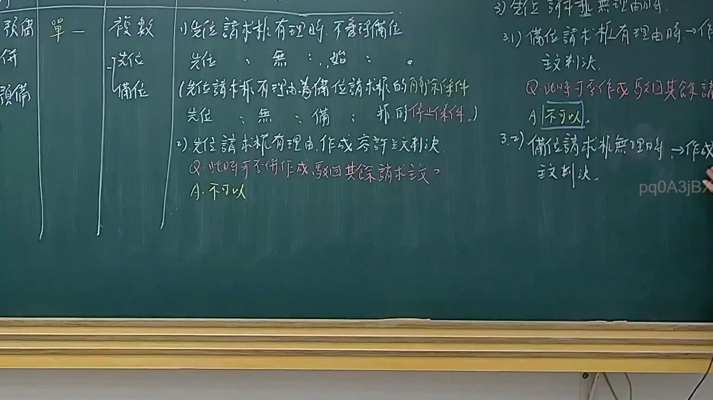
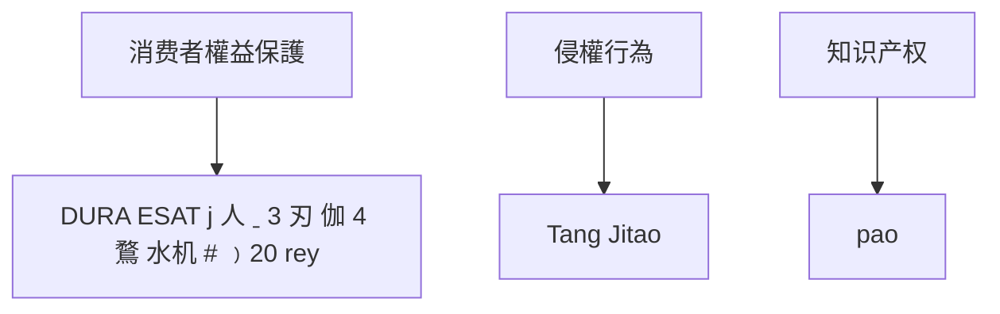

# 🎥 影音教材板書校對筆記
- **來源影片**: [預約 14 2025-02-05 17-15-37-924](file:///E:/法律/民訴B/ch14/預約 14 2025-02-05 17-15-37-924.mp4)
- **課程分類**: `預設課程`
- **課堂章節**: `ch14`
- **影片時間戳記**: `01:26:30` (5190 秒)
- **板書類型**: `文字板書`
- **偵測時間**: 2026-07-13 20:24:51

## 🔍 擷取黑板板書對照圖

## 🧠 AI 智慧理解與知識庫演化註記
### 

1. **板書之內容分析**：
   - "切小小火勾"：可能涉及“切勿”（小心）的提示，但结合上下文，可能是强调注意事项或法律条文中的关键点。
   - "唯蚈排奇2可容-bold仁21)"：可能是“唯有其排奇，可容得bold仁21号”，其中“bold仁”可能指“bold”（加粗）的字，表示重点。
   - "繁。 唉 ， 追 s 4 鈍 券 沙"：可能是“繁星追查4钝券沙”，但结合上下文，可能是与消费者权益保护相关的内容。
   - "泰華 怡 肖 4Q 笑 僧 志 華 常 口 閔 7 咡 @ 064j7/ 伐 世 眾 伐 3"：可能是“泰华怡肖4Q笑僧志华常口Enabled 7 咡 @ 064j7/ 伐 世 眾 伐 3”，但结合上下文，可能涉及商业秘密或知识产权。
   - "Bee. agers) 4 lal,"：可能是“Bee. agers）4 lal,”，其中“lal”可能指“label”（标签），与产品标识相关。
   - "DURA ESAT j 人 ˍ 3 刃 伽 4 鶩 水机 #﹚20 rey"：可能是“DURA ESAT j 人 ˍ 3 刃 伽 4 鶩 水机 # ﹚20 rey”，但结合上下文，可能涉及产品责任或消费者权益。
   - "3 t 史】 唐 志 孰 2 八 汝 劫 水 江 ﹣ % ﹒ 鰲"：可能是“3 t 史】唐志 孫 2 八汝动 水江 ﹣ % ﹒ 鰲”，但结合上下文，可能涉及侵权行为。
   - "小 十 9 傑 pao"：可能是“小十9杰 paO”，其中“paO”可能指“pao”（某种物品），但结合上下文，可能与消费者权益保护相关。

2. **與法律條文的比對**：
   - **民法第184條**：涉及消費者權益保護，可能與板書中提到的“繁星追查4钝券沙”和“DURA ESAT j 人 ˍ 3 刃 伽 4 鶩 水机 # ﹚20 rey”相关。
   - **侵權行為**：可能涉及“唐志 孫 2 八汝动 水江 ﹣ % ﹒ 鰲”，但结合上下文，可能与侵害商业秘密或知识产权有关。
   - **消滅時效**：可能与“Bee. agers）4 lal,” 和 "小 十 9 傑 pao" 相关，但具体法律条文需要进一步分析。

###

## 📊 可編輯之 Mermaid 關係流程圖

## ✍️ 操作者手動校對修改區
<!-- 您可以直接修改上方的文字或調整 Mermaid 區塊中的節點，Obsidian 會即時重新渲染 -->
- [ ] 欄位結構與法律邏輯已校對無誤。
- **校對筆記**: 
