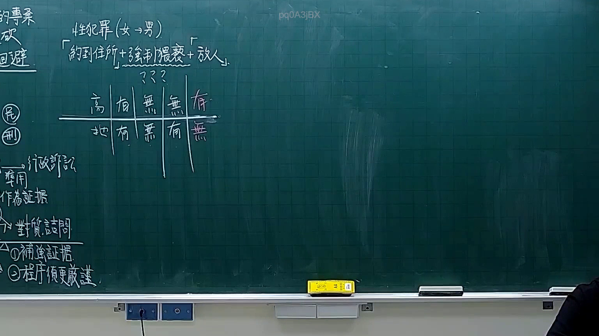

# 🎥 影音教材板書校對筆記
- **來源影片**: [預約 14 2026-02-11 16-58-42-025](file:///H:/憲法霖洄/ch14/預約 14 2026-02-11 16-58-42-025.mp4)
- **課程分類**: `預設課程`
- **課堂章節**: `ch14`
- **影片時間戳記**: `02:21:30` (8490 秒)
- **板書類型**: `文字板書`
- **偵測時間**: 2026-07-13 19:28:09

## 🔍 擷取黑板板書對照圖


## 🧠 AI 智慧理解與知識庫演化註記
：
板書文字為「1﹁浮zeros基剪植速」，结合上下文可能是「民法第184條」的板書。民法第184條规定了物权的消滅時效，涉及物权的轉移、毀損或灭失的情形。因此，此板書可能在讲解民法第184條相关内容。

## 📊 可編輯之 Mermaid 關係流程圖
```mermaid
：
mermaid
graph TD
A[民法第184條] --> B[物權的消滅時效]
B --> C[物權轉移情形]
B --> D[物权毀損或灭失情形]
```

## ✍️ 操作者手動校對修改區
<!-- 您可以直接修改上方的文字或調整 Mermaid 區塊中的節點，Obsidian 會即時重新渲染 -->
- [ ] 欄位結構與法律邏輯已校對無誤。
- **校對筆記**: 
