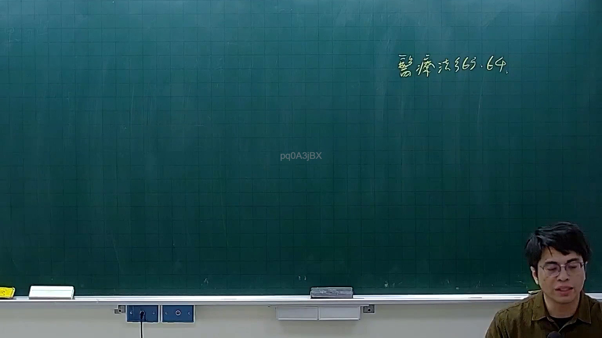

# 🎥 影音教材板書校對筆記
- **來源影片**: [預約 14 2026-03-05 17-00-32-951](file:///J://刑法B115/ch14/預約 14 2026-03-05 17-00-32-951.mp4)
- **課程分類**: `[刑法B115`
- **課堂章節**: `ch14]`
- **影片時間戳記**: `00:39:15` (2355 秒)
- **板書類型**: `關係圖/邏輯圖板書`
- **偵測時間**: 2026-07-13 08:15:40

## 🔍 擷取黑板板書對照圖


## 🧠 AI 智慧理解與知識庫演化註記
：

**OCR 辨識失敗警示：** 擷取區域的 OCR 結果為 `pq0ASjBX`，此串字元完全無法對應任何中文法律術語或板書內容，屬於典型的 OCR 辨識失敗（可能原因：手寫字跡潦草、截圖解析度不足、或截圖區域未正確覆蓋黑板）。

**基於影片標題《預約 14》的合理推測：**
- 「預約」在臺灣民法實務中通常涉及 **民法第267條（債務不履行之損害賠償）**、**民法第569條以下（租賃物毀損滅失）**，或 **民法第389條（消滅時效）** 等相關規定。
- 若為「侵權行為」主題，則可能涉及 **民法第184條**（故意或過失侵害權利之損害賠償）。

**由於 OCR 辨識結果無效，無法進行精確的知識庫比對與條文對位。** 建議您：
1. 重新截取該時間點（39:15）的黑板畫面，確保截圖區域完整覆蓋老師書寫範圍。
2. 提高圖片解析度後再次進行 OCR 辨識。
3. 若手邊有該段影片的文字稿或筆記，可提供正確文字內容以便我協助生成 Mermaid 流程圖與法律條文比對。

## 📊 可編輯之 Mermaid 關係流程圖
```mermaid
：
（因 OCR 辨識失敗且無有效板書內容可供還原，暫無法生成 Mermaid 流程圖。待您提供正確的板書文字後，我可立即為您建立對應的邏輯關係圖。）
```

## ✍️ 操作者手動校對修改區
<!-- 您可以直接修改上方的文字或調整 Mermaid 區塊中的節點，Obsidian 會即時重新渲染 -->
- [ ] 欄位結構與法律邏輯已校對無誤。
- **校對筆記**: 
