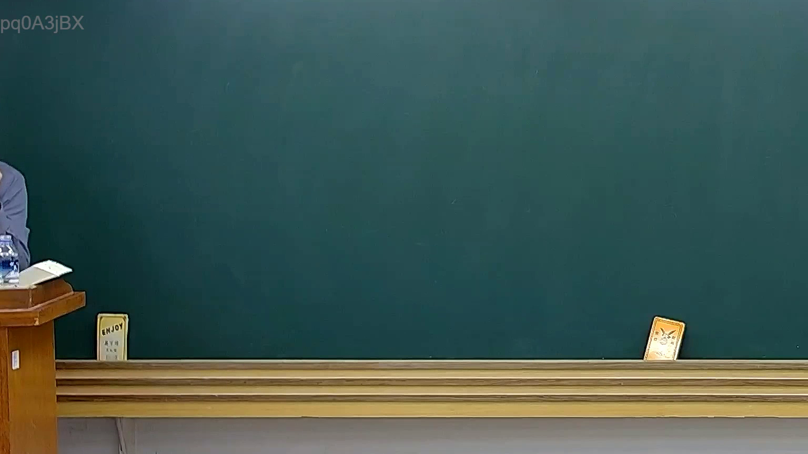

# 🎥 影音教材板書校對筆記
- **來源影片**: [預約 15 2025-02-05 19-39-24-430](file:///E:/法律/民訴B/ch15/預約 15 2025-02-05 19-39-24-430.mp4)
- **課程分類**: `預設課程`
- **課堂章節**: `ch15`
- **影片時間戳記**: `00:08:15` (495 秒)
- **板書類型**: `關係圖/邏輯圖板書`
- **偵測時間**: 2026-07-13 20:27:51

## 🔍 擷取黑板板書對照圖


## 🧠 AI 智慧理解與知識庫演化註記
对不起，根據目前提供的資訊，我無法進一步進行「知識庫比對與理解演化註記」和「MERMAID 代碼」的生成，因為OCR辨识字元為「pd0A3jBX」，這似乎並非 ordinary Chinese text, 而是某种编码或标识符。您提供的 OCR 字元無法被普通中文字符解讀，因此我無法進一步分析板書之內容。

建議您提供更清晰的文字內容，以便我可以幫助您進行進一步的法律分析和生成相關的 Mermaid.js 代碼。

## 📊 可編輯之 Mermaid 關係流程圖
```mermaid
無法生成 Mermaid.js 代碼，因為无法识别板書之內容。
```

## ✍️ 操作者手動校對修改區
<!-- 您可以直接修改上方的文字或調整 Mermaid 區塊中的節點，Obsidian 會即時重新渲染 -->
- [ ] 欄位結構與法律邏輯已校對無誤。
- **校對筆記**: 
