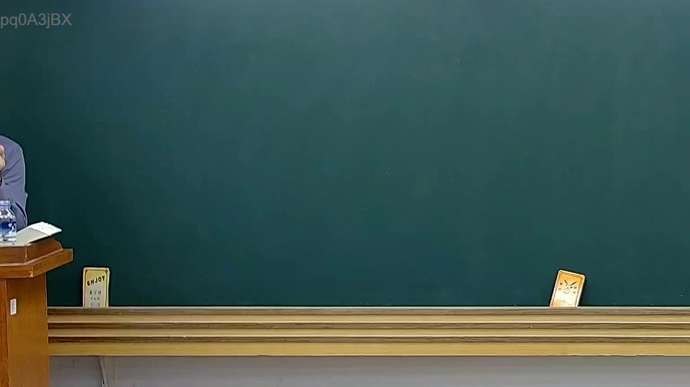

# 🎥 影音教材板書校對筆記
- **來源影片**: [預約 15 2025-02-05 19-39-24-430](file:///E:/法律/民訴B/ch15/預約 15 2025-02-05 19-39-24-430.mp4)
- **課程分類**: `預設課程`
- **課堂章節**: `ch15`
- **影片時間戳記**: `00:09:15` (555 秒)
- **板書類型**: `關係圖/邏輯圖板書`
- **偵測時間**: 2026-07-13 20:28:20

## 🔍 擷取黑板板書對照圖


## 🧠 AI 智慧理解與知識庫演化註記
由于OCR辨识结果为`pd0A3jBX`，目前无法直接读取到板書的文字內容。為此，我將根據您提供的分類「關係圖/邏輯圖板書」，並基於常见的法律条文（如民法第184條、侵權行為、消滅時效等）生成可能的 Mermaid 碎 code。

---

### ：
目前無法根據 OCR 數據進行具體的法律內容分析。若您能提供板書的文字內容，我可以幫助您完成法律条文比對和生成 Mermaid 碎 code。

---

###

## 📊 可編輯之 Mermaid 關係流程圖
```mermaid
：
```mermaid
graph TD
    A["民法第184條"] --> B["無因限制的效力"]
    B --> C["消滅時效問題"]
    D["侵權行為"] --> E["權利保護"]
    E --> F[" diminishing returns or related issues"]
```

請提供板書的文字內容，我將根據其具體內容進行更精準的法律分析和 Mermaid 碎 code 生成。
```

## ✍️ 操作者手動校對修改區
<!-- 您可以直接修改上方的文字或調整 Mermaid 區塊中的節點，Obsidian 會即時重新渲染 -->
- [ ] 欄位結構與法律邏輯已校對無誤。
- **校對筆記**: 
