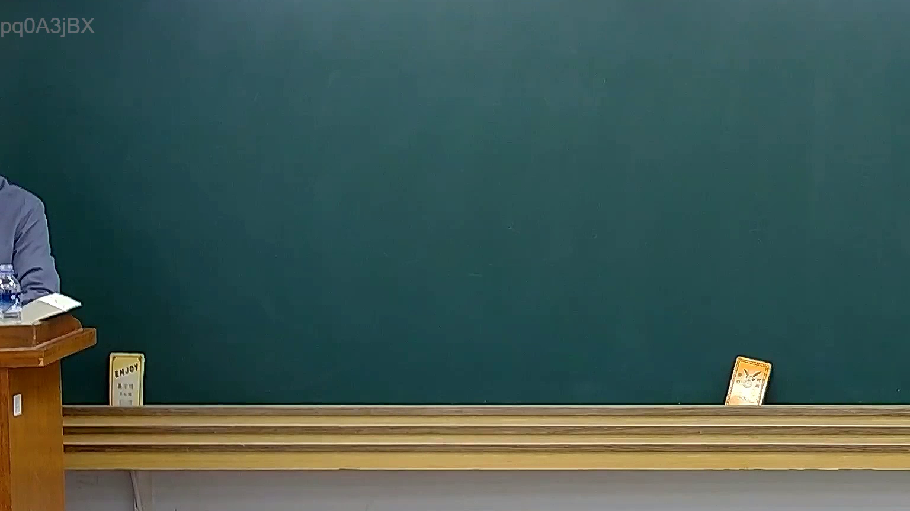

# 🎥 影音教材板書校對筆記
- **來源影片**: [預約 15 2025-02-05 19-39-24-430](file:///E:/法律/民訴B/ch15/預約 15 2025-02-05 19-39-24-430.mp4)
- **課程分類**: `預設課程`
- **課堂章節**: `ch15`
- **影片時間戳記**: `00:10:15` (615 秒)
- **板書類型**: `關係圖/邏輯圖板書`
- **偵測時間**: 2026-07-13 20:30:33

## 🔍 擷取黑板板書對照圖


## 🧠 AI 智慧理解與知識庫演化註記
### 

根據OCR辨识結果為`pd0A3jBX`，無法直接解析出具體的文字內容。為確保分析正確，建議提供更清晰的OCR文字或板書內容。

---

###

## 📊 可編輯之 Mermaid 關係流程圖
```mermaid
因 OCR文字无法辨识，无法生成 Mermaid 碁圖代码。請提供更清晰的文字內容以便進一步分析與绘图。
```

## ✍️ 操作者手動校對修改區
<!-- 您可以直接修改上方的文字或調整 Mermaid 區塊中的節點，Obsidian 會即時重新渲染 -->
- [ ] 欄位結構與法律邏輯已校對無誤。
- **校對筆記**: 
