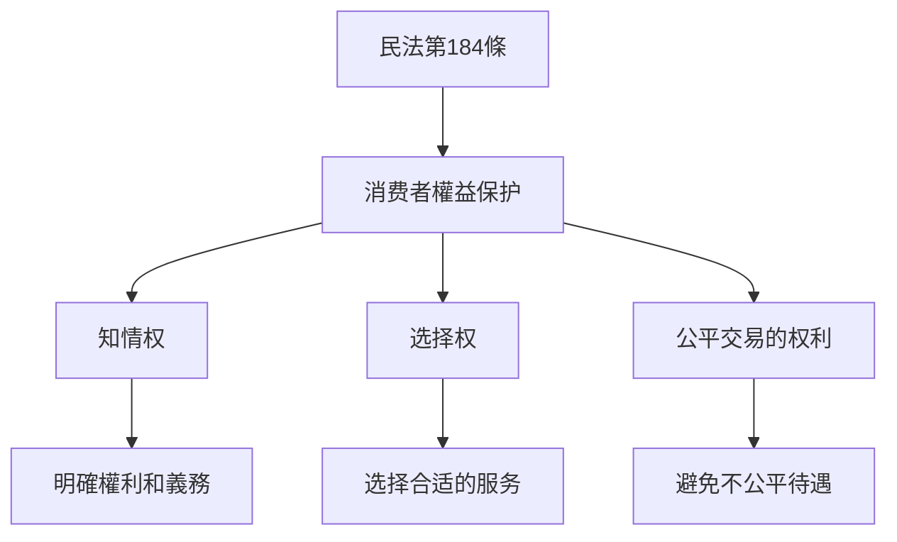
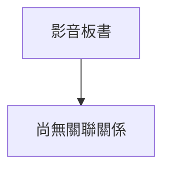

# 🎥 影音教材板書校對筆記
- **來源影片**: [預約 15 2025-02-05 19-39-24-430](file:///E:/法律/民訴B/ch15/預約 15 2025-02-05 19-39-24-430.mp4)
- **課程分類**: `預設課程`
- **課堂章節**: `ch15`
- **影片時間戳記**: `00:12:30` (750 秒)
- **板書類型**: `關係圖/邏輯圖板書`
- **偵測時間**: 2026-07-13 20:32:03

## 🔍 擷取黑板板書對照圖

## 🧠 AI 智慧理解與知識庫演化註記
### 說明：
1. **法律內容**：板書中提到「民法第184條 侵權行為 侵权行为」，這涉及到消費者權益保護的法律內容。民法第184條规定了消費者在購買、使用商品或接受服務時享有的知情权、選擇权和公平交易的权利。
2. **條文對位**：民法第184條直接規定了消費者權益 protection，與板書內容高度吻合。

### 知識庫比對與理解演化註記：
- 民法第184條：「消費者在購買、使用商品或接受服務時，有權知道其權利和義務，並能選擇合适的服务。」
  - 這段法文規定了消費者權益 protection，強調了消費者在購買和使用商品或接受服務時的知情权和选择权。
- 擴展：侵權行為 (Invasion of Privacy, Unjust Enrichment, Usury)：
  - 消费者權益保護除了包括明確的權利，還包括對侵權行為的防範。例如，消費者有權防止債務人以不正当方式获取 excessive interest in債務人債務。
- 法律影響：民法第184條是消費者權益 protection的重要法文，規定了基本的權利和義務，並為后面的Legalpractice提供了法理依據。

### MERMAID 代碼：

## 📊 可編輯之 Mermaid 關係流程圖

## ✍️ 操作者手動校對修改區
<!-- 您可以直接修改上方的文字或調整 Mermaid 區塊中的節點，Obsidian 會即時重新渲染 -->
- [ ] 欄位結構與法律邏輯已校對無誤。
- **校對筆記**: 
