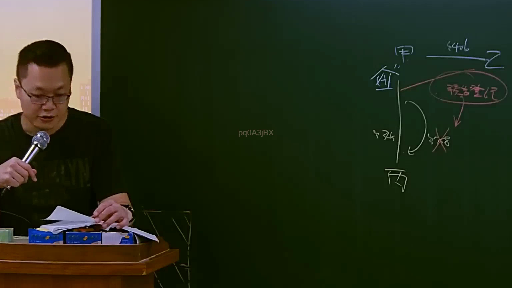

# 🎥 影音教材板書校對筆記
- **來源影片**: [預約 15 2025-04-14 19-23-41-725](file:///J://民法B/ch15/預約 15 2025-04-14 19-23-41-725.mp4)
- **課程分類**: `[民法B`
- **課堂章節**: `ch15]`
- **影片時間戳記**: `00:09:30` (570 秒)
- **板書類型**: `影音板書`
- **偵測時間**: 2026-07-09 19:25:52

## 🔍 擷取黑板板書對照圖


## 🧠 AI 智慧理解與知識庫演化註記
：

這張板書圖片所呈現的法律概念主要圍繞著**債權人撤銷訴權**（或稱詐害債權行為撤銷訴權），這是臺灣民法中保護債權人權益的重要機制。

1.  **當事人關係與債權債務背景**：
    *   **甲**：為**債權人**，對乙存有債權。
    *   **乙**：為**債務人**，對甲負有債務。
    *   **丙**：為**受贈第三人**，即債務人乙將財產轉移的對象。
    *   板書上方橫線標示的「**§406**」：此為臺灣《民法》**第406條**，內容關於**贈與契約**：「稱贈與者，謂當事人約定，一方以自己之財產無償給與他方，他方允受之契約。」其位置（在甲與乙的上方連線上）可能指示此案涉及的債務人行為是一項贈與，或是甲對乙的某項債權與贈與行為有關聯。在此情境下，最合理的解釋是**債務人乙將財產贈與給第三人丙**。
    *   「**金**」與「**丁34**」：這兩者被標示在甲的下方，並透過箭頭連接到「移告登記」，應代表**被移轉的特定財產或權利**（例如金錢、特定標號的資產或債權）。「丁34」可能是對該財產的進一步描述或編號。

2.  **詐害債權行為**：
    *   「**移告登記**」：此為非典型法律用語，但結合上下文，應指「**移轉登記**」或「**轉讓與通知**」。它代表債務人乙將其名下財產（金/丁34）登記轉移給第三人丙的行為。
    *   此「移告登記」的行為，即債務人乙將財產贈與（民法§406）給第三人丙，導致債務人乙的資產減少，進而**損害了債權人甲的債權**（即乙的償債能力受損）。

3.  **債權人採取的法律行動**：
    *   「**§244**」：此為臺灣《民法》**第244條**，關於**債權人撤銷訴權**（Revocatory Action）。
        *   第244條第1項規定：「債務人所為之無償行為，有害及債權者，債權人得聲請法院撤銷之。」（若為無償行為，如贈與，不論債務人是否明知有害債權，債權人皆可聲請撤銷）
        *   第244條第2項規定：「債務人所為之有償行為，於行為時明知有損害於債權人之權利者，以受益人於受益時亦知其情事者為限，債權人得聲請法院撤銷之。」
        *   此處因涉及「§406 贈與」，故主要適用於第244條第1項，即**債權人甲可以向法院聲請撤銷乙贈與丙財產的行為**，以使該財產回復到乙的名下，供甲強制執行。
    *   「**§278 X**」：此為臺灣《民法》**第278條**，關於**代位權**：「債務人怠於行使其權利時，債權人因保全債權，得以自己之名義，行使其權利。但專屬於債務人本身者，不在此限。」板書上標示「X」，明確指出**在此案例中，代位權不適用**。這是因為代位權適用於債務人怠於行使其對第三人的權利，而撤銷訴權適用於債務人**積極地**將財產處分給第三人以規避債務的情況。兩者適用情境不同。

4.  **板書符號的額外解讀**：
    *   圖片右側中央的橢圓形框住了「移告登記」，並有箭頭指向其下方的「§244」和「§278 X」，強化了「移告登記」是導致法律程序啟動的核心事件。
    *   左下方的垂直線從甲經過金、丁34到丙，以及其右側的「D」形曲線與箭頭，形象化地表示了資產從債務人處流向第三人，以及債權人介入後試圖追回或使轉移無效的法律關係與流動。

總結而言，這張板書清晰地闡述了當債務人（乙）以贈與（民法第406條）方式將財產（金/丁34）移轉（移告登記）給第三人（丙），而此行為損害債權人（甲）權益時，債權人應援引《民法》第244條提起撤銷訴權以保全其債權，而非第278條的代位權。

## 📊 可編輯之 Mermaid 關係流程圖
```mermaid
：
graph TD
    A["債權人 甲"]
    B["債務人 乙"]
    C["受贈第三人 丙"]
    D["被移轉財產 (金/丁34)"]
    E["移轉登記/通知"]
    F["贈與行為 (民法§406)"]
    G["撤銷訴權 (民法§244)"]
    H["代位權 (民法§278)"]

    A -->|"對 乙 有債權"| B;
    B -->|"實施 F (將 D)"| F;
    F -->|"結果為"| D;
    D -->|"經 E"| E;
    E -->|"所有權歸屬"| C;
    F -->|"此行為導致"| I["損害甲之債權"];
    I --> A;
    A -->|"為保全債權 提起"| G;
    G -->|"針對 F"| F;
    G -->|"涉訟對象為"| B;
    G -->|"涉訟對象為"| C;
    H -->|"不適用此情況 (X)"| A;
```

## ✍️ 操作者手動校對修改區
<!-- 您可以直接修改上方的文字或調整 Mermaid 區塊中的節點，Obsidian 會即時重新渲染 -->
- [ ] 欄位結構與法律邏輯已校對無誤。
- **校對筆記**: 
