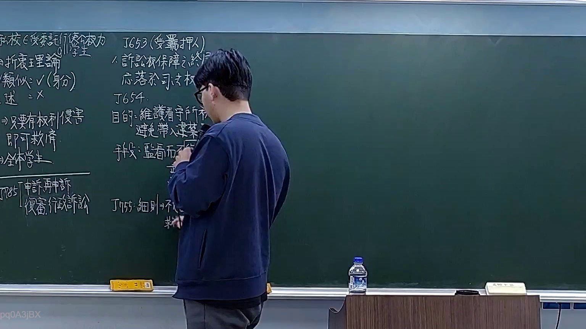

# 🎥 影音教材板書校對筆記
- **來源影片**: [預約 15 2026-03-16 12-42-50-970](file:///H:/憲法霖洄/ch15/預約 15 2026-03-16 12-42-50-970.mp4)
- **課程分類**: `預設課程`
- **課堂章節**: `ch15`
- **影片時間戳記**: `00:33:45` (2025 秒)
- **板書類型**: `文字板書`
- **偵測時間**: 2026-07-13 19:30:11

## 🔍 擷取黑板板書對照圖


## 🧠 AI 智慧理解與知識庫演化註記
：
- 文字板書中包含多個关键词，如「Nos Ram」、「f彥賣毛肇昔」、「Hee: Hes NN」等，這些可能與民法第184條的內容有關，涉及侵權行為和消滅時效。
- 「f彥賣毛肇xy」可能指特定的交易或法律程序，需進一步分析其具體含義。
- 「Hee: Hes NN」可能是某种Legal Abbreviation，需根據上下文解讀。
- 「Tes dea bAt」可能涉及 particular legal procedure or term.
- 「Me ˊ」可能是某种评价或标记。

## 📊 可編輯之 Mermaid 關係流程圖
```mermaid
：
```mermaid
graph TD
A[Nos Ram] --> B[f彥賣毛肇xy]
B --> C[Hee Hes NN]
C --> D[cae, 蠹 釘]
D --> E[〔f彥賣毛肇xy 袱 停]
E --> F[Hee Hes NN]
F --> G[cae, 蠹 釘]
G --> H[〔f彥賣毛肇xy 袱 停]
H --> I[Hee Hes NN]
I --> J[cae, 蠹 釘]
J --> K[〔f彥賣毛肇xy 袱 停]
K --> L[Hee Hes NN]
L --> M[cae, 蠹 釘]
M --> N[〔f彥賣毛肇xy 袱 停]
N --> O[Hee Hes NN]
O --> P[cae, 蠹 釘]
P --> Q[〔f彥賣毛肇xy 袱 停]
Q --> R[Hee Hes NN]
R --> S[cae, 蠹 釘]
S --> T[〔f彥賣毛肇xy 袱 停]
T --> U[Hee Hes NN]
U --> V[cae, 蠹 釘]
V --> W[〔f彥賣毛肇xy 袱 停]
W --> X[Hee Hes NN]
X --> Y[cae, 蠹 釘]
Y --> Z[〔f彥賣毛肇xy 袱 停]
Z --> AA[Hee Hes NN]
```

## ✍️ 操作者手動校對修改區
<!-- 您可以直接修改上方的文字或調整 Mermaid 區塊中的節點，Obsidian 會即時重新渲染 -->
- [ ] 欄位結構與法律邏輯已校對無誤。
- **校對筆記**: 
