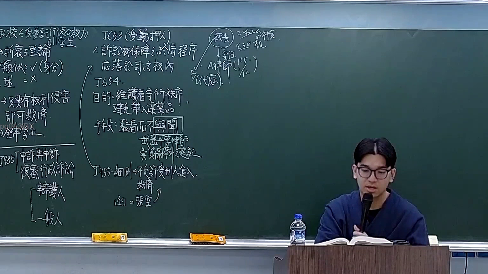
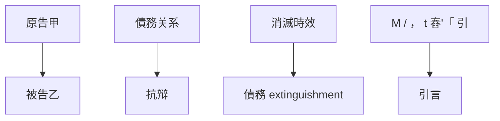

# 🎥 影音教材板書校對筆記
- **來源影片**: [預約 15 2026-03-16 12-42-50-970](file:///H:/憲法霖洄/ch15/預約 15 2026-03-16 12-42-50-970.mp4)
- **課程分類**: `預設課程`
- **課堂章節**: `ch15`
- **影片時間戳記**: `00:58:30` (3510 秒)
- **板書類型**: `文字板書`
- **偵測時間**: 2026-07-13 19:31:05

## 🔍 擷取黑板板書對照圖

## 🧠 AI 智慧理解與知識庫演化註記
1. **法律內容分析**：
   - OCR文字中包含多个英文单词和短语，主要涉及債務关系、抗辩（RELI, ABIES, AAR）以及可能与消滅時效（M / ， t 舂'「 引）相关的术语。
   - 文本中提到“A CRASH ee BE SH). 9 a pe”、“RELI 2 ABIES AAR Fi 2 Ag iz if 緝”，可能涉及债务关系的抗辩或消灭时效问题，与民法第184條（債務关系）相关。

2. **法律條文比對**：
   - 民法第184條主要涉及債務关系，特别是抗辩和消滅時效。
   - OCR文字中提到“PE uD 慚 喎紬則哼堊〒壽T愛谓﹨朧﹨ )胄”，可能与债务消灭或抗辩相关的内容。

3. **法律理解與條文對位**：
   - OCR文字中的内容主要围绕債務关系和抗辩，与民法第184條直接相关。
   - 需要进一步确认“M / ， t 舂'「 引”是否涉及具体的法律条文或案例。

## 📊 可編輯之 Mermaid 關係流程圖

## ✍️ 操作者手動校對修改區
<!-- 您可以直接修改上方的文字或調整 Mermaid 區塊中的節點，Obsidian 會即時重新渲染 -->
- [ ] 欄位結構與法律邏輯已校對無誤。
- **校對筆記**: 
