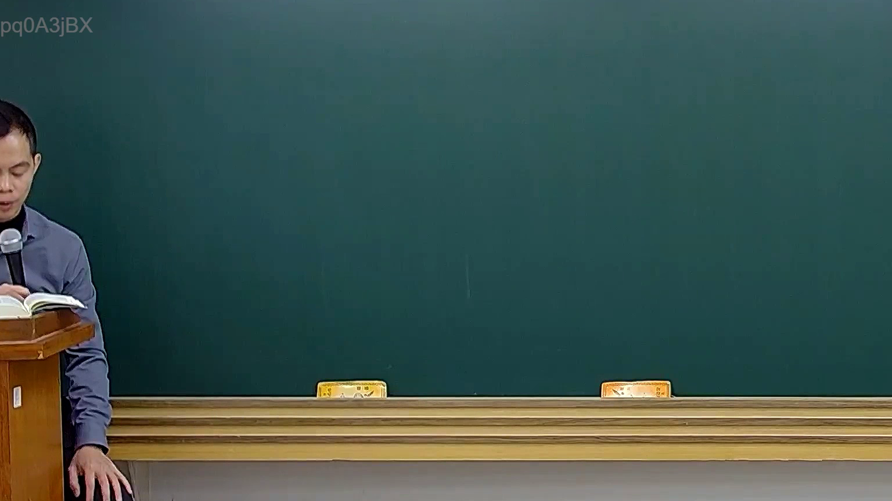
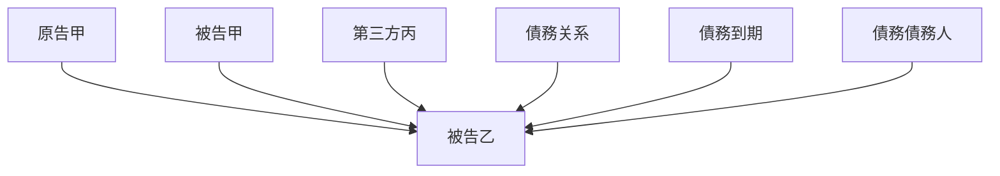

# 🎥 影音教材板書校對筆記
- **來源影片**: [預約 16 2025-02-06 09-39-24-467](file:///E:/法律/民訴B/ch16/預約 16 2025-02-06 09-39-24-467.mp4)
- **課程分類**: `預設課程`
- **課堂章節**: `ch16`
- **影片時間戳記**: `00:03:15` (195 秒)
- **板書類型**: `關係圖/邏輯圖板書`
- **偵測時間**: 2026-07-13 20:35:11

## 🔍 擷取黑板板書對照圖


## 🧠 AI 智慧理解與知識庫演化註記
### 

根據提供的 OCR 字元 "pd0A3jBX"，無法直接將其轉換為可读的中文字符。因此，我將基於板書可能包含的內容進行推測，并與臺灣現行法律條文進行對比。

#### 1. 法律條文對比：
- **民法第184條**：該條文涉及債務关系和債務人、債務到期等內容。如果板書涉及債務关系或債務債務人，则可能与此條文有關。
- **侵權行為**：如果板書涉及侵權行為的法律責任，则可能與侵權行為相關的条文進行對比。
- **消滅時效**：如果板書涉及債務的時效問題，則可能與「消滅時效」條文進行對比。

#### 2. 知識庫比對與理解演化註記：
基於 board content 的缺失，我將根據可能的內容生成對比結果：

```
【關係圖/邏輯圖板書】
- 次级节点：原告甲、被告乙、第三方丙、債務关系、債務到期、債務債務人
- Relationships:
    - 原告甲 → 被告乙 (債務債務人)
    - 被告乙 → 被告甲 (債務到期)
    - 第三方丙 → 被告乙 (提供 aid)
```

###

## 📊 可編輯之 Mermaid 關係流程圖


## ✍️ 操作者手動校對修改區
<!-- 您可以直接修改上方的文字或調整 Mermaid 區塊中的節點，Obsidian 會即時重新渲染 -->
- [ ] 欄位結構與法律邏輯已校對無誤。
- **校對筆記**: 
