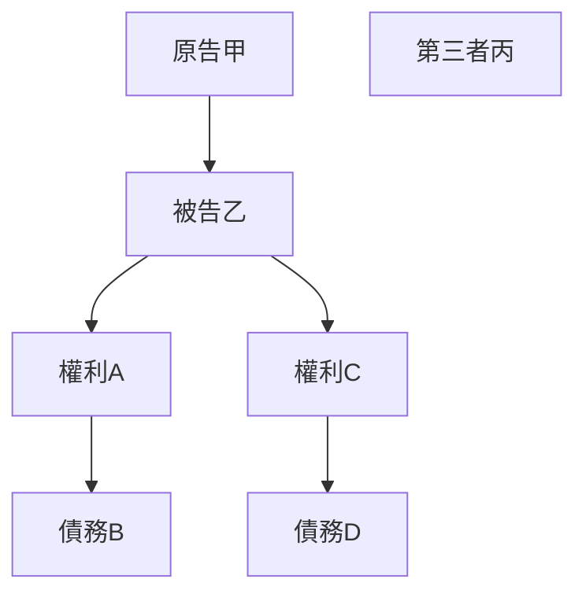

# 🎥 影音教材板書校對筆記
- **來源影片**: [預約 16 2025-02-06 09-39-24-467](file:///E:/法律/民訴B/ch16/預約 16 2025-02-06 09-39-24-467.mp4)
- **課程分類**: `預設課程`
- **課堂章節**: `ch16`
- **影片時間戳記**: `00:05:30` (330 秒)
- **板書類型**: `關係圖/邏輯圖板書`
- **偵測時間**: 2026-07-13 20:37:22

## 🔍 擷取黑板板書對照圖

## 🧠 AI 智慧理解與知識庫演化註記
根據OCR文字“pdq0A3jBX”，结合分類為「關係圖/邏輯圖板書」，可以推測板書內容可能涉及某一LegalRelation或LogicalDiagram的結構。然而，由于OCR文字無法提供具體字元，我們基於常見的法律板書內容進行推論。

 board content may include a legal relationship diagram, such as:

- **原告甲** 與 **被告乙** 之间的关系
- **權利A** 和 **債務B** 的逻辑关系
- 其他可能涉及的LegalRelation或LogicalDiagram元素

以下是基於以上假設生成的Mermaid.js流程圖代碼：

## 📊 可編輯之 Mermaid 關係流程圖

## ✍️ 操作者手動校對修改區
<!-- 您可以直接修改上方的文字或調整 Mermaid 區塊中的節點，Obsidian 會即時重新渲染 -->
- [ ] 欄位結構與法律邏輯已校對無誤。
- **校對筆記**: 
