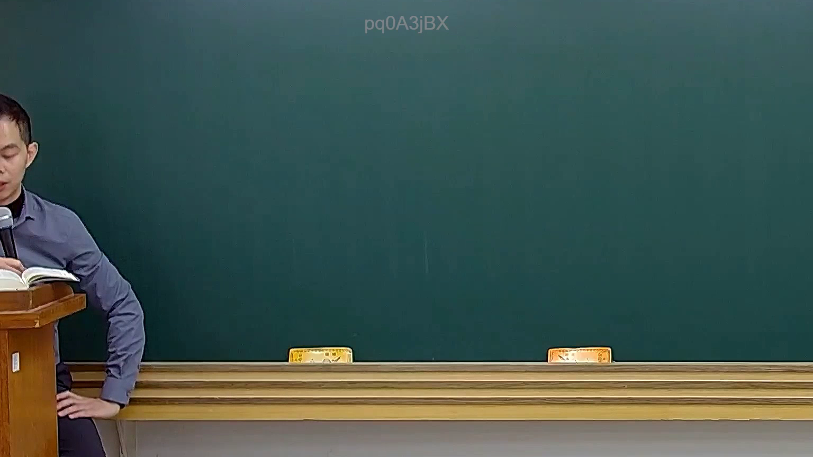
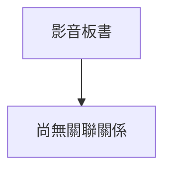

# 🎥 影音教材板書校對筆記
- **來源影片**: [預約 16 2025-02-06 09-39-24-467](file:///E:/法律/民訴B/ch16/預約 16 2025-02-06 09-39-24-467.mp4)
- **課程分類**: `預設課程`
- **課堂章節**: `ch16`
- **影片時間戳記**: `00:06:30` (390 秒)
- **板書類型**: `關係圖/邏輯圖板書`
- **偵測時間**: 2026-07-13 20:38:55

## 🔍 擷取黑板板書對照圖

## 🧠 AI 智慧理解與知識庫演化註記
（無法取得本地大模型之智能註記分析）

## 📊 可編輯之 Mermaid 關係流程圖

## ✍️ 操作者手動校對修改區
<!-- 您可以直接修改上方的文字或調整 Mermaid 區塊中的節點，Obsidian 會即時重新渲染 -->
- [ ] 欄位結構與法律邏輯已校對無誤。
- **校對筆記**: 
