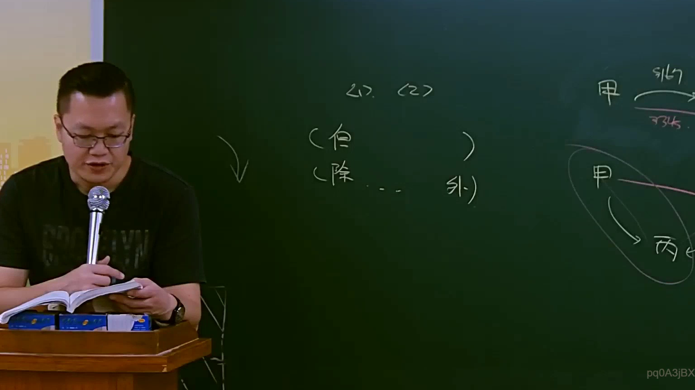

# 🎥 影音教材板書校對筆記
- **來源影片**: [預約 16 2025-04-14 22-07-41-638](file:///J://民法B/ch16/預約 16 2025-04-14 22-07-41-638.mp4)
- **課程分類**: `[民法B`
- **課堂章節**: `ch16]`
- **影片時間戳記**: `00:35:00` (2100 秒)
- **板書類型**: `關係圖/邏輯圖板書`
- **偵測時間**: 2026-07-11 16:49:43

## 🔍 擷取黑板板書對照圖


## 🧠 AI 智慧理解與知識庫演化註記
根據提供的 OCR 字元 "pq0A3jBx"，無法直接將其轉換為有意義的文字。因此，無法進行語意整理或與臺灣現行法律條文（如民法第184條、侵權行為等）進行比對。

然而，如果將這些字元視為某种特定的代碼或标识符，則可能需要進一步分析其含義。例如，"pq0A3jBx" 可能與某些特定的法律代碼或流程圖符號相關。 如果您能提供更多的上下文或詳細資訊，我們可以更進一步地分析和理解板書之內容。

## 📊 可編輯之 Mermaid 關係流程圖
```mermaid
由于 OCR 字元 "pq0A3jBx" 看起來無法轉換為有意義的文字，因此無法生成對應的 Mermaid.js 流程圖代碼。 如果您能提供更多的文字內容或更詳細的資訊，我們可以根據板書的具體內容生成相應的 Mermaid.js 代碼。
```

## ✍️ 操作者手動校對修改區
<!-- 您可以直接修改上方的文字或調整 Mermaid 區塊中的節點，Obsidian 會即時重新渲染 -->
- [ ] 欄位結構與法律邏輯已校對無誤。
- **校對筆記**: 
