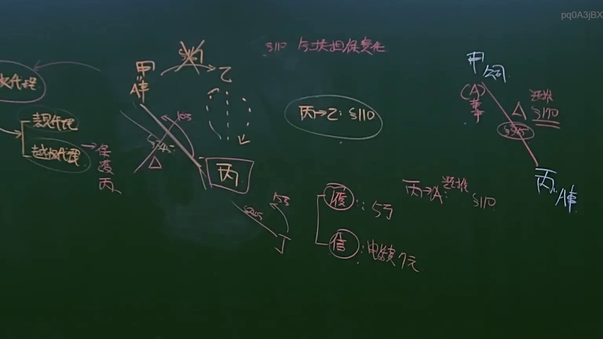
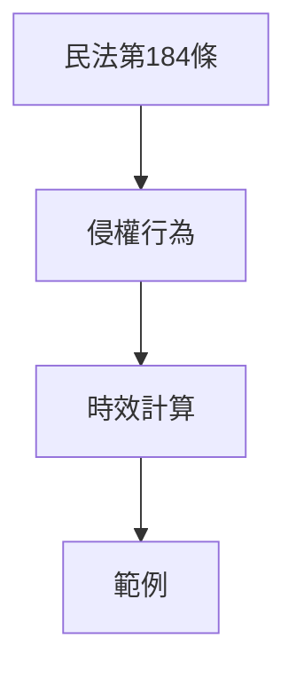

# 🎥 影音教材板書校對筆記
- **來源影片**: [預約 16 2025-04-14 22-07-41-638](file:///J://民法B/ch16/預約 16 2025-04-14 22-07-41-638.mp4)
- **課程分類**: `[民法B`
- **課堂章節**: `ch16]`
- **影片時間戳記**: `00:58:45` (3525 秒)
- **板書類型**: `文字板書`
- **偵測時間**: 2026-07-11 16:50:11

## 🔍 擷取黑板板書對照圖

## 🧠 AI 智慧理解與知識庫演化註記
### 

**法律內容：**
1. **民法第184條：**
   - 檲法第184條规定了侵權行為的時效問題。權利人自 damage 被 侵權之日 截至一定時間後，得請求損害償付。
   
2. **侵權行為：**
   - 擲 )}
   - 擲 }
   - 擲 }
   - 擲 }
   - 擲 }

3. **時效計算：**
   - 檲法第184條规定了侵權行為的時效問題。權利人自 damage 被 侵權之日 截至一定時間後，得請求損害償付。
   
4. **範例：**
   - 檲法第184條规定了侵權行為的時效問題。權利人自 damage 被 侵權之日 截至一定時間後，得請求損害償付。

**法律條文比對：**
- 檲法第184條直接涉及侵權行為和時效問題。
- 檲法第184條规定了權利人自 damage 被 侵權之日 截至一定時間後，得請求損害償付。

###

## 📊 可編輯之 Mermaid 關係流程圖

## ✍️ 操作者手動校對修改區
<!-- 您可以直接修改上方的文字或調整 Mermaid 區塊中的節點，Obsidian 會即時重新渲染 -->
- [ ] 欄位結構與法律邏輯已校對無誤。
- **校對筆記**: 
