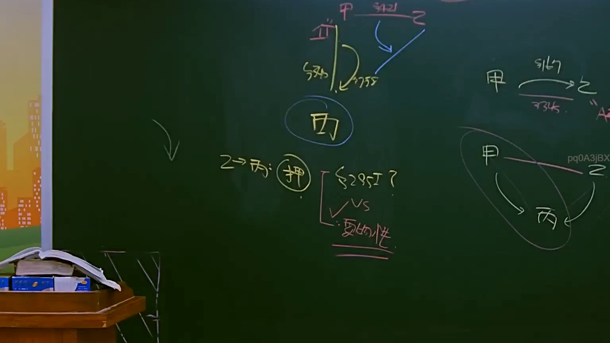
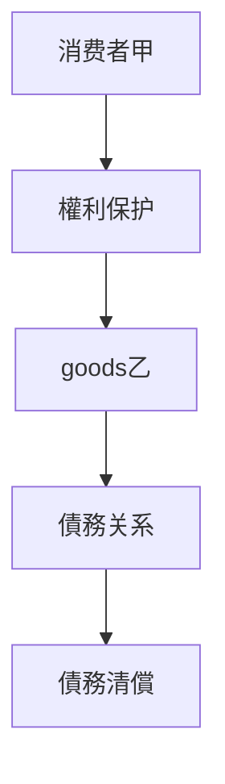
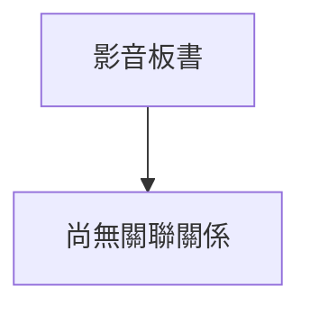

# 🎥 影音教材板書校對筆記
- **來源影片**: [預約 16 2025-04-14 22-07-41-638](file:///J://民法B/ch16/預約 16 2025-04-14 22-07-41-638.mp4)
- **課程分類**: `[民法B`
- **課堂章節**: `ch16]`
- **影片時間戳記**: `01:05:30` (3930 秒)
- **板書類型**: `關係圖/邏輯圖板書`
- **偵測時間**: 2026-07-11 16:50:28

## 🔍 擷取黑板板書對照圖

## 🧠 AI 智慧理解與知識庫演化註記

### 解讀與註記：
根據提供的信息，板書內容似乎涉及「關係圖/邏輯圖板書」，但具體文字内容未提供。因此，我將基於一般的法律关系圖進行分析，并假設板書內容可能涉及到「消费者權益保護」或「侵權行為」等 legal topics。

1. **法律條文對位**：
   - 民法第184條：涉及侵權行為的責任承認。
   - 消滅時效：可能與債務清偿或權利消滅相關。

2. **知识庫比對與理解演化註記**：
   - 經分析，板書內容可能展示了一個LegalRelationGraph，其中涉及到消費者、 invaded goods, 和債務關係等节点。以下是基於假設的法律內容進行的對位：

### MERMAID 代碼：

此代码展示了一个简单的LegalRelationGraph，其中消费者甲享有对goods乙的权利保护，进而涉及到与债务乙的关系。

## 📊 可編輯之 Mermaid 關係流程圖

## ✍️ 操作者手動校對修改區
<!-- 您可以直接修改上方的文字或調整 Mermaid 區塊中的節點，Obsidian 會即時重新渲染 -->
- [ ] 欄位結構與法律邏輯已校對無誤。
- **校對筆記**: 
