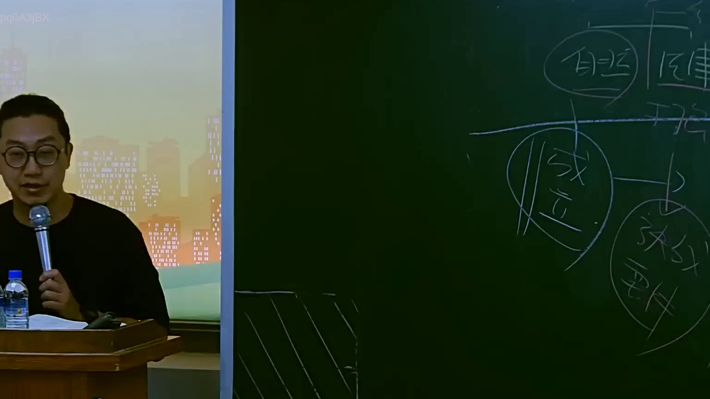
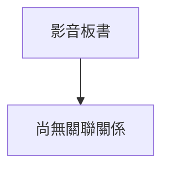

# 🎥 影音教材板書校對筆記
- **來源影片**: [預約 16 2025-07-25 09-16-33-736](file:///J://行政法A/ch16/預約 16 2025-07-25 09-16-33-736.mp4)
- **課程分類**: `[行政法A`
- **課堂章節**: `ch16]`
- **影片時間戳記**: `00:00:45` (45 秒)
- **板書類型**: `關係圖/邏輯圖板書`
- **偵測時間**: 2026-07-13 10:19:51

## 🔍 擷取黑板板書對照圖

## 🧠 AI 智慧理解與知識庫演化註記
：

您好！您的訊息中「擷取區域的 OCR 辨識字元」部分為空白，未實際提供辨識出的文字內容。因此我無法進行以下工作：

1. **語意整理** — 無原始文字可分析
2. **條文比對**（民法第184條、侵權行為、消滅時效等）— 無板書內容可對位
3. **Mermaid 流程圖生成** — 無法繪製關係圖或邏輯樹

---

請您重新提供 OCR 辨識出的文字，例如：

> 「契約成立 → 債務不履行 → 損害賠償請求權」

一旦收到文字內容，我將立即為您完成：

- 📝 **知識庫比對與理解演化註記**（對照民法、侵權行為法、消滅時效等條文）
- 🌳 **Mermaid.js 流程圖代碼**（關係圖/邏輯圖或條列式邏輯樹，節點文字以雙引號括住）

期待您的補充！

## 📊 可編輯之 Mermaid 關係流程圖

## ✍️ 操作者手動校對修改區
<!-- 您可以直接修改上方的文字或調整 Mermaid 區塊中的節點，Obsidian 會即時重新渲染 -->
- [ ] 欄位結構與法律邏輯已校對無誤。
- **校對筆記**: 
