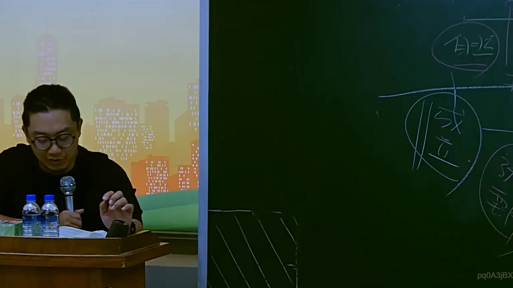
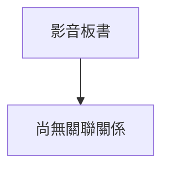

# 🎥 影音教材板書校對筆記
- **來源影片**: [預約 16 2025-07-25 09-16-33-736](file:///J://行政法A/ch16/預約 16 2025-07-25 09-16-33-736.mp4)
- **課程分類**: `[行政法A`
- **課堂章節**: `ch16]`
- **影片時間戳記**: `00:18:45` (1125 秒)
- **板書類型**: `關係圖/邏輯圖板書`
- **偵測時間**: 2026-07-13 10:20:21

## 🔍 擷取黑板板書對照圖

## 🧠 AI 智慧理解與知識庫演化註記
：

您好，您提供的訊息中「擷取區域的 OCR 辨識字元」部分為空白，未實際附上老師板書上的文字內容。因此我無法進行以下工作：

1. **語意整理** — 無原始文字可分析
2. **法律條文比對**（民法第184條、侵權行為、消滅時效等）— 無辨識字元可供對位
3. **Mermaid 流程圖生成** — 無法從空內容建構圖表結構

---

請您補充以下任一方式，我即可立即完成分析：

- 📋 **直接貼上 OCR 辨識出的文字**（即使有錯別字也沒關係）
- 🖼️ **提供截圖檔案**，我可嘗試自行 OCR 辨識
- 📝 **口述板書內容**，我會依您的描述整理並生成對應圖表

一旦收到實際內容，我將立即：
1. 對照臺灣現行民法、侵權行為法理與消滅時效規定進行條文比對
2. 根據板書邏輯關係（因果、要件、例外等）生成 Mermaid.js 流程圖
3. 附上知識庫比對註記，說明法律概念的演化與實務應用

期待您的補充！

## 📊 可編輯之 Mermaid 關係流程圖

## ✍️ 操作者手動校對修改區
<!-- 您可以直接修改上方的文字或調整 Mermaid 區塊中的節點，Obsidian 會即時重新渲染 -->
- [ ] 欄位結構與法律邏輯已校對無誤。
- **校對筆記**: 
