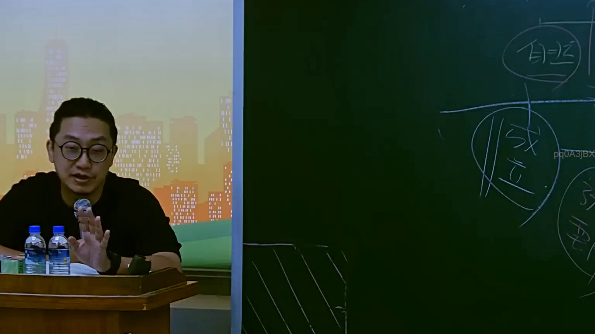
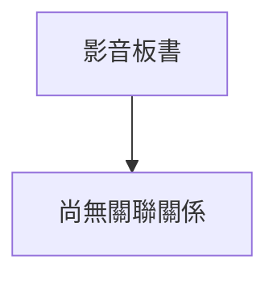

# 🎥 影音教材板書校對筆記
- **來源影片**: [預約 16 2025-07-25 09-16-33-736](file:///J://行政法A/ch16/預約 16 2025-07-25 09-16-33-736.mp4)
- **課程分類**: `[行政法A`
- **課堂章節**: `ch16]`
- **影片時間戳記**: `00:25:30` (1530 秒)
- **板書類型**: `關係圖/邏輯圖板書`
- **偵測時間**: 2026-07-13 10:20:41

## 🔍 擷取黑板板書對照圖

## 🧠 AI 智慧理解與知識庫演化註記
：

您好，您的訊息中「擷取區域的 OCR 辨識字元如下：」之後**未附上實際的 OCR 辨識文字**。因此我無法進行以下工作：

1. **語意整理** — 無文字可分析
2. **條文比對**（民法第184條、侵權行為、消滅時效等）— 無內容可對位
3. **Mermaid.js 流程圖生成** — 無法繪製關係圖或邏輯樹

---

請您將 OCR 辨識出的板書字元貼上，我即可立即為您完成：

- 📖 語意整理與法律條文比對註記
- 🔗 Mermaid.js 流程圖代碼（含雙引號節點格式）

例如您可以這樣提供：
> OCR文字：「侵權行為之構成要件：1. 不法行為 2. 損害發生 3. 因果關係」

收到後我會立刻處理。

## 📊 可編輯之 Mermaid 關係流程圖

## ✍️ 操作者手動校對修改區
<!-- 您可以直接修改上方的文字或調整 Mermaid 區塊中的節點，Obsidian 會即時重新渲染 -->
- [ ] 欄位結構與法律邏輯已校對無誤。
- **校對筆記**: 
