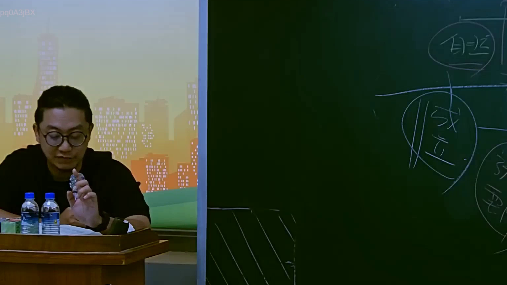

# 🎥 影音教材板書校對筆記
- **來源影片**: [預約 16 2025-07-25 09-16-33-736](file:///J://行政法A/ch16/預約 16 2025-07-25 09-16-33-736.mp4)
- **課程分類**: `[行政法A`
- **課堂章節**: `ch16]`
- **影片時間戳記**: `00:27:30` (1650 秒)
- **板書類型**: `關係圖/邏輯圖板書`
- **偵測時間**: 2026-07-13 10:21:23

## 🔍 擷取黑板板書對照圖


## 🧠 AI 智慧理解與知識庫演化註記
：

您好，您提供的 OCR 辨識字元內容為空白（「擷取區域的 OCR 辨識字元如下：」之後無實際文字）。因此我無法進行以下工作：

1. **語意整理** — 沒有具體板書文字，無法分析其法律邏輯結構。
2. **條文比對** — 無法與民法第184條、侵權行為、消滅時效等現行法條進行對位。
3. **Mermaid 圖表生成** — 缺少節點資訊，無法繪製關係圖或邏輯樹。

---

## 📊 可編輯之 Mermaid 關係流程圖
```mermaid
：

（待提供 OCR 文字後再補上）

---

📌 **請您補充擷取區域的實際 OCR 辨識字元內容**，我將立即為您完成：
- 語意整理與法律條文比對註記
- 對應的 Mermaid.js 流程圖代碼
```

## ✍️ 操作者手動校對修改區
<!-- 您可以直接修改上方的文字或調整 Mermaid 區塊中的節點，Obsidian 會即時重新渲染 -->
- [ ] 欄位結構與法律邏輯已校對無誤。
- **校對筆記**: 
