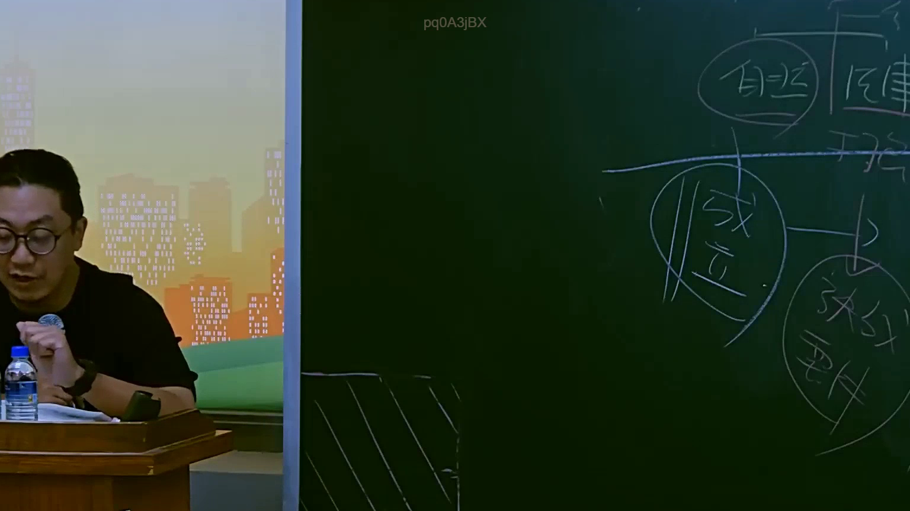

# 🎥 影音教材板書校對筆記
- **來源影片**: [預約 16 2025-07-25 09-16-33-736](file:///J://行政法A/ch16/預約 16 2025-07-25 09-16-33-736.mp4)
- **課程分類**: `[行政法A`
- **課堂章節**: `ch16]`
- **影片時間戳記**: `00:33:45` (2025 秒)
- **板書類型**: `關係圖/邏輯圖板書`
- **偵測時間**: 2026-07-13 10:22:00

## 🔍 擷取黑板板書對照圖


## 🧠 AI 智慧理解與知識庫演化註記
您好！感謝您的詳細說明，但我注意到您提供的訊息中，**OCR 辨識字元區域為空白**（「擷取區域的 OCR 辨識字元如下：」之後沒有實際文字內容）。

因此我目前無法進行以下工作：
1. 語意整理與條文比對
2. 生成 Mermaid.js 流程圖代碼

---

### 請您補充提供：

- **OCR 辨識出的板書文字**（即使有錯字或斷句，也請一併貼上）
- 若方便，也可附上該時間點的截圖，我可以協助進一步確認內容

一旦收到完整資訊，我將立即為您完成：
- 📖 — 語意整理 + 民法/侵權行為/消滅時效等條文比對
- 📊

## 📊 可編輯之 Mermaid 關係流程圖
```mermaid
— 關係圖 / 邏輯樹 Mermaid 程式碼

請補充後回覆，我隨時待命！
```

## ✍️ 操作者手動校對修改區
<!-- 您可以直接修改上方的文字或調整 Mermaid 區塊中的節點，Obsidian 會即時重新渲染 -->
- [ ] 欄位結構與法律邏輯已校對無誤。
- **校對筆記**: 
