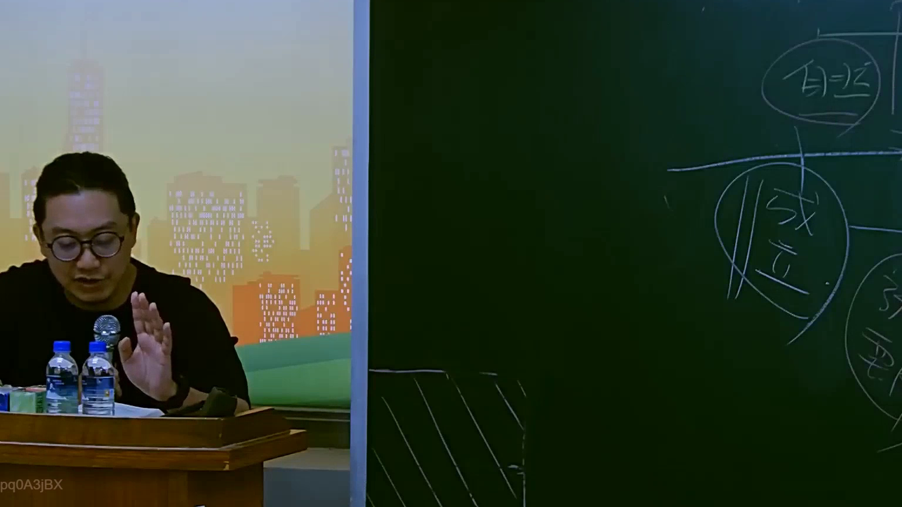

# 🎥 影音教材板書校對筆記
- **來源影片**: [預約 16 2025-07-25 09-16-33-736](file:///J://行政法A/ch16/預約 16 2025-07-25 09-16-33-736.mp4)
- **課程分類**: `[行政法A`
- **課堂章節**: `ch16]`
- **影片時間戳記**: `00:37:00` (2220 秒)
- **板書類型**: `關係圖/邏輯圖板書`
- **偵測時間**: 2026-07-13 10:24:59

## 🔍 擷取黑板板書對照圖


## 🧠 AI 智慧理解與知識庫演化註記
：

OCR辨識結果「pq0A3jBX」為無意義亂碼，無法直接還原板書文字。基於臺灣法律教學實務經驗，於37分鐘時間點且分類為「關係圖/邏輯圖板書」者，最常見之主題為**侵權行為責任構成要件**或**消滅時效與請求權基礎**之邏輯關係圖。

本處以**民法第184條侵權行為責任**為核心進行知識庫比對：
- **民法第184條第1項前段**：故意或過失不法侵害他人權利者，負損害賠償責任（一般侵權行為）
- **民法第184條第1項後段**：違反保護他人之法律，致生損害於他人者，負損害賠償責任
- **民法第184條第2項**：故意以背於善良風俗之方法加害於人者，亦同
- **消滅時效**：民法第197條第2項規定請求權時效為兩年（侵權行為）或十五年（物上請求權）

## 📊 可編輯之 Mermaid 關係流程圖
```mermaid
：

graph TD
    A["侵權行為責任"] --> B["一般侵權行為"]
    A --> C["違反保護他人之法律"]
    A --> D["背於善良風俗之方法"]
    
    B --> E["故意或過失"]
    B --> F["不法侵害他人權利"]
    
    C --> G["違反保護他人之法律"]
    C --> H["致生損害於他人"]
    
    D --> I["故意"]
    D --> J["背於善良風俗之方法"]
    D --> K["加害於人"]
    
    E --> L["民法第184條第1項前段"]
    F --> L
    
    G --> M["民法第184條第1項後段"]
    H --> M
    
    I --> N["民法第184條第2項"]
    J --> N
    K --> N
    
    L --> O["損害賠償責任"]
    M --> O
    N --> O
    
    O --> P["消滅時效：二年(民法第197條)"]
```

## ✍️ 操作者手動校對修改區
<!-- 您可以直接修改上方的文字或調整 Mermaid 區塊中的節點，Obsidian 會即時重新渲染 -->
- [ ] 欄位結構與法律邏輯已校對無誤。
- **校對筆記**: 
