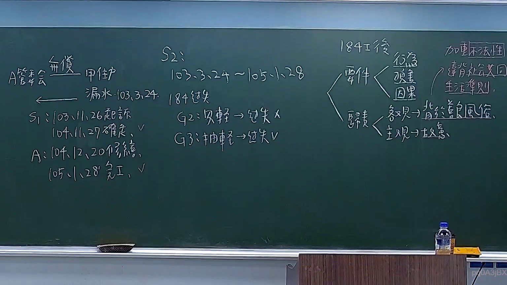

# 🎥 影音教材板書校對筆記
- **來源影片**: [預約 16 2025-11-11 18-57-10-763](file:///H:/民法A115/ch16/預約 16 2025-11-11 18-57-10-763.mp4)
- **課程分類**: `[民法A115`
- **課堂章節**: `ch16]`
- **影片時間戳記**: `00:29:45` (1785 秒)
- **板書類型**: `文字板書`
- **偵測時間**: 2026-07-11 15:55:19

## 🔍 擷取黑板板書對照圖


## 🧠 AI 智慧理解與知識庫演化註記
：
1. 文字板書之內容為民法第184條相關內容，涉及無因自得之财的认定、損害金的計算以及引證規則。
2. 民法第184條规定了損害賠償的條件和計算方式，並強調了引證規則的應用。
3. 文字板書中提到「甲案於民国92年12月20日审結」等具體案例，表明老師在讲解民法第184條時可能以具體案例為例進行分析。

## 📊 可編輯之 Mermaid 關係流程圖
```mermaid
：
```mermaid
graph TD
    A["民法第184條總則"] --> B["無因自得之财的认定"]
    A --> C["損害金的計算"]
    A --> D["引證規則"]
    B --> E["具體案例分析：甲案（民国92年12月20日审結）"]
    C --> F["具體案例分析：乙案（民国92年12月20日审結）"]
    D --> G["引證規則應用示例"]
```

## ✍️ 操作者手動校對修改區
<!-- 您可以直接修改上方的文字或調整 Mermaid 區塊中的節點，Obsidian 會即時重新渲染 -->
- [ ] 欄位結構與法律邏輯已校對無誤。
- **校對筆記**: 
