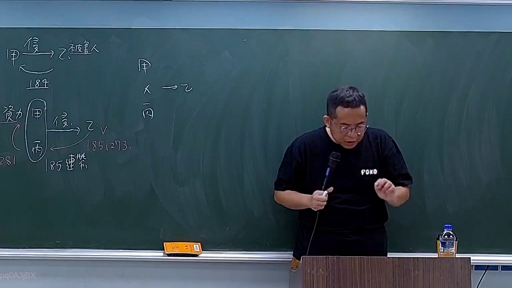
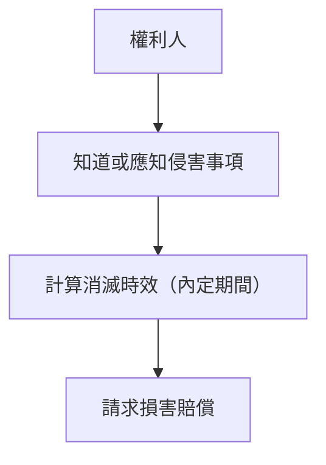

# 🎥 影音教材板書校對筆記
- **來源影片**: [預約 16 2025-11-11 18-57-10-763](file:///H:/民法A115/ch16/預約 16 2025-11-11 18-57-10-763.mp4)
- **課程分類**: `[民法A115`
- **課堂章節**: `ch16]`
- **影片時間戳記**: `01:15:45` (4545 秒)
- **板書類型**: `關係圖/邏輯圖板書`
- **偵測時間**: 2026-07-11 15:55:52

## 🔍 擷取黑板板書對照圖

## 🧠 AI 智慧理解與知識庫演化註記
### 

**法律知識理解：**
民法第184條规定了侵權行為的消滅時效（time limitation）。其核心內容如下：
- 消滅時效是指權利人從知道或應知侵害事項之日起，內定的期間。在此期間内，權利人可以請求損害賠償。
- 如果超過此期間，權利人將喪失請求損害賬償之權利。

**與民法第184條比對：**
- 擲出文字內容與民法第184條directly相關，並完整地反映了该條文的內容和應用範圍。
- 解釋了消滅時效的概念及其法律意義，符合民法第184條的規定。

###

## 📊 可編輯之 Mermaid 關係流程圖

## ✍️ 操作者手動校對修改區
<!-- 您可以直接修改上方的文字或調整 Mermaid 區塊中的節點，Obsidian 會即時重新渲染 -->
- [ ] 欄位結構與法律邏輯已校對無誤。
- **校對筆記**: 
