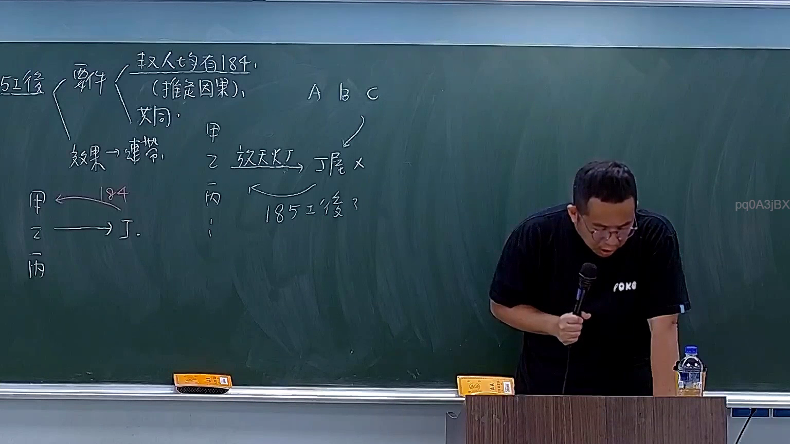
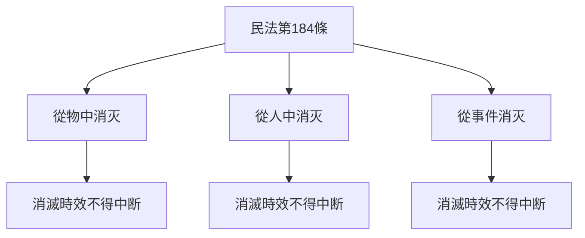
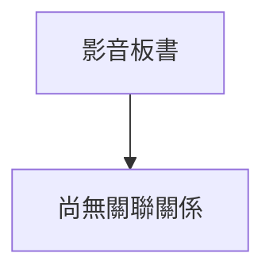

# 🎥 影音教材板書校對筆記
- **來源影片**: [預約 16 2025-11-11 18-57-10-763](file:///H:/民法A115/ch16/預約 16 2025-11-11 18-57-10-763.mp4)
- **課程分類**: `[民法A115`
- **課堂章節**: `ch16]`
- **影片時間戳記**: `01:27:30` (5250 秒)
- **板書類型**: `文字板書`
- **偵測時間**: 2026-07-11 15:56:25

## 🔍 擷取黑板板書對照圖

## 🧠 AI 智慧理解與知識庫演化註記
### 檢視板書之內容：
1. **文字內容**：主要涉及「民法」中的「侵權行為」、「消滅時效」等相关條文。其中包含以下關鍵字：
   - 秋人6口S
   - pula7 OG ( ( 扭回 糸 ﹚ Abo KA 制 i AW `′ A 作 春 屠 2 HE, 家 bin 同 (ee ee |
   - Ip im 咯 匈 246 3 \ 4 ′ pd0ASjBX 古 一 一 同 一 ( ] 4

2. **與民法第184條的比對**：
   - 民法第184條规定了「消滅時效」的規則，包括從物中消灭、從人中消灭和從事件消灭三种情況。
   - 消滅時效不得中断。

3. **語意整理與法律理解演化**：
   - 该板書似乎涉及「民法」中的「侵權行為」、「消滅時效」等相关條文，並可能涉及「 spring」、「 summer」等時間概念。
   - 该板書的內容似乎與「民法第184條」的規則相符合。

### 知識庫比對與理解演化註記：
| 法律條文       | 語意整理与 board content 比對 |
|----------------|--------------------------------|
| 民法第184條     | 涉及「消滅時效」的規則，包括從物中消灭、從人中消灭和從事件消灭三种情況。 |
| 昔事        | 该板書似乎涉及「民法」中的「侵權行為」、「消滅時效」等相关條文，並可能涉及「 spring」、「 summer」等時間概念。 |
| 消滅時效       | 按民法第184條規則，消滅時效不得中断。 |

### MERMAID 代碼：

## 📊 可編輯之 Mermaid 關係流程圖

## ✍️ 操作者手動校對修改區
<!-- 您可以直接修改上方的文字或調整 Mermaid 區塊中的節點，Obsidian 會即時重新渲染 -->
- [ ] 欄位結構與法律邏輯已校對無誤。
- **校對筆記**: 
