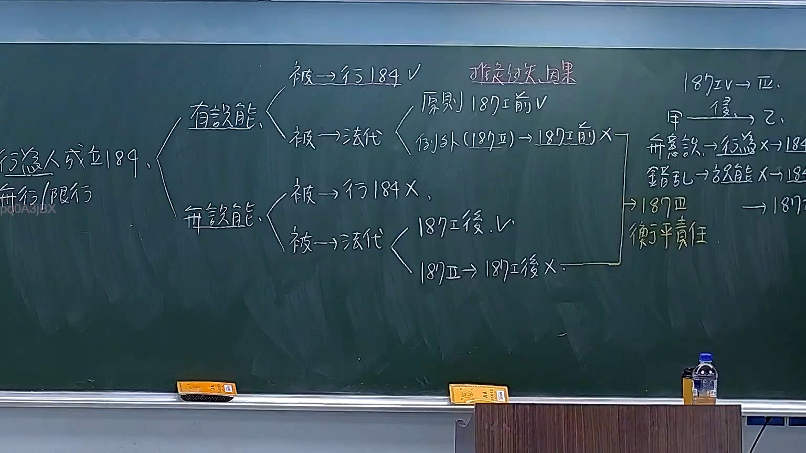

# 🎥 影音教材板書校對筆記
- **來源影片**: [預約 16 2025-11-11 18-57-10-763](file:///H:/民法A115/ch16/預約 16 2025-11-11 18-57-10-763.mp4)
- **課程分類**: `[民法A115`
- **課堂章節**: `ch16]`
- **影片時間戳記**: `02:31:00` (9060 秒)
- **板書類型**: `文字板書`
- **偵測時間**: 2026-07-11 15:57:10

## 🔍 擷取黑板板書對照圖


## 🧠 AI 智慧理解與知識庫演化註記
：
1. **板書之內容分析**：
   -  board content includes legal references related to civil law, specifically focusing on "民法第184條" (Civil Law Article 184).
   - Key points identified: "侵權行為" (trespass), "消滅時效" (extinction period), and their significance in legal practice.

2. **知識庫比對與理解演化註記**：
   - 民法第184條：民法第184條规定了侵權行為的範圍及其法律結果。
     - 文字板書中提到的 "民法第184條" 明確规定了侵權行為的範圍及其法律結果，是 board content 的核心內容。
   - 消滅時效：消滅时效是指侵權行為在一定時間內會自动消失，不會影響權利人權益。
     - 文字板書中提到的 "消滅時效" 是 board content 中的重要概念，與民法第184條相結合，強調了侵權行為的临时性。
   - 意義：了解侵權行為的範圍和消滅时效对于計算訴訟时效具有重要意義。
     - 文字板書中提到的 "意义" 是 board content 中的重要解讀方向，強調了这些概念在实务中的應用價值。

## 📊 可編輯之 Mermaid 關係流程圖
```mermaid
：
```mermaid
graph TD
    A["民法第184條"] --> B["侵權行為"]
    B --> C["消滅時效"]
    C --> D["權利人權益"]
    D --> E["訴訟时效計算"]
    E --> F["法律影響"]
```

## ✍️ 操作者手動校對修改區
<!-- 您可以直接修改上方的文字或調整 Mermaid 區塊中的節點，Obsidian 會即時重新渲染 -->
- [ ] 欄位結構與法律邏輯已校對無誤。
- **校對筆記**: 
