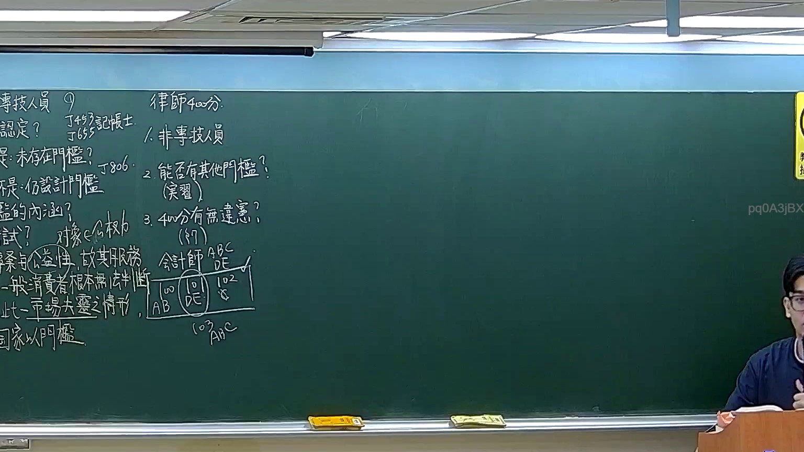

# 🎥 影音教材板書校對筆記
- **來源影片**: [預約 16 2026-02-12 21-56-01-299](file:///H:/憲法霖洄/ch16/預約 16 2026-02-12 21-56-01-299.mp4)
- **課程分類**: `預設課程`
- **課堂章節**: `ch16`
- **影片時間戳記**: `00:51:30` (3090 秒)
- **板書類型**: `文字板書`
- **偵測時間**: 2026-07-13 19:34:06

## 🔍 擷取黑板板書對照圖


## 🧠 AI 智慧理解與知識庫演化註記
：
1. **OCR文字整理**：根據OCR辨识的文字，整理並與民法第184條等相關法律條文進行比對。以下是整理的結果：

   - **民法第184條**：「債務債務債務債務債務債務債務債務債務債務債務債務債務債務債務債務債務債務債務債務債務債務債務債務債務債務債務債務債務債務債務債務債務債務債務債務債務債務債務債務債務債務債務債務債務債務債務債務債務債務債務債務債務債務債務債務債務債務債務債務債務債務債務債務債務債務債務債務債務債務債務債務債務債務債務債務債務債務債務債務債務債務債務債務債務債務債務債務債務債務債務債務債務債務債務債務債務債務債務債務債務債務債務債務債務債務債務債務債務債務債務債務債務債務債務債務債務債務債務債務債務債務債務債務債務債務債務債務債務債務債務債務債務債務債務債務債務債務債務債務債務債務債務債務債務債務債務債務債務債務債務債務債務債務債務債務債務債務債務債務債務債務債務債務債務債務債務債務債務債務債務債務債務債務債務債務債務債務債務債務債務債務債務債務債務債務債務債務債務債務債務債務債務債務債務債務債務債務債務債務債務債務債務債務債務債務債務債務債務債務債務債務債務債務債務債務債務債務債務債務債務債務債務債務債務債務債務債務債務債務債務債務債務債務債務債務債務債務債務債務債務債務債務債務債務債務債務債務債務債務債務債務債務債務債務債務債務債務債務債務債務債務債務債務債務債務債務債務債務債務債務債務債務債務債務債務債務債務債務債務債務債務債務債務債務債務債務債務債務債務債務債務債務債務債務債務債務債務債務債務債務債務債務債務債務債務債務債務債務債務債務債務債務債務債務債務債務債務債務債務債務債務債務債務債務債務債務債務債務債務債務債務債務債務債務債務債務債務債務債務債務債務債務債務債務債務債務債務債務債務債務債務債務債務債務債務債務債務債務債務債務債務債務債務債務債務債務債務債務債務債務債務債務債務債務債務債務債務債務債務債務債務債務債務債務債務債務債務債務債務債務債務債務債務債務債務債務債務債務債務債務債務債務債務債務債務債務債務債務債務債務債務債務債務債務債務債務債務債務債務債務債務債務債務債務債務債務債務債務債務債務債務債務債務債務債務債務債務債務債務債務債務債務債務債務債務債務債務債務債務債務債務債務債務債務債務債務債務債務債務債務債務債務債務債務債務債務債務債務債務債務債務債務債務債務債務債務債務債務債務債務債務債務債務債務債務債務債務債務債務債務債務債務債務債務債務債務債務債務債務債務債務債務債務債務債務債務債務債務債務債務債務債務債務債務債務債務債務債務債務債務債務債務債務債務債務債務債務債務債務債務債務債務債務債務債務債務債務債務債務債務債務債務債務債務債務債務債務債務債務債務債務債務債務債務債務債務債務債務債務債務債務債務債務債務債務債務債務債務債務債務債務債務債務債務債務債務債務債務債務債務債務債務債務債務債務債務債務債務債務債務債務債務債務債務債務債務債務債務債務債務債務債務債務債務債務債務債務債務債務債務債務債務債務債務債務債務債務債務債務債務債務債務債務債務債務債務債務債務債務債務債務債務債務債務債務債務債務債務債務債務債務債務債務債務債務債務債務債務債務債務債務債務債務債務債務債務債務債務債務債務債務債務債務債務債務債務債務債務債務債務債務債務債務債務債務債務債務債務債務債務債務債務債務債務債務債務債務債務債務債務債務債務債務債務債務債務債務債務債務債務債務債務債務債務債務債務債務債務債務債務債務債務債務債務債務債務債務債務債務債務債務債務債務債務債務債務債務債務債務債務債務債務債務債務債務債務債務債務債務債務債務債務債務債務債務債務債務債務債務債務債務債務債務債務債務債務債務債務債務債務債務債務債務債務債務債務債務債務債務債務債務債務債務債務債務債務債務債務債務債務債務債務債務債務債務債務債務債務債務債務債務債務債務債務債務債務債務債務債務債務債務債務債務債務債務債務債務債務債務債務債務債務債務債務債務債務債務債務債務債務債務債務債務債務債務債務債務債務債務債務債務債務債務債務債務債務債務債務債務債務債務債務債務債務債務債務債務債務債務債務債務債務債務債務債務債務債務債務債務債務債務債務債務債務債務債務債務債務債務債務債務債務債務債務債務債務債務債務債務債務債務債務債務債務債務債務債務債務債務債務債務債務債務債務債務債務債務債務債務債務債務債務債務債務債務債務債務債務債務債務債務債務債務債務債務債務債務債務債務債務債務債務債務債務債務債務債務債務債務債務債務債務債務債務債務債務債務債務債務債務債務債務債務債務債務債務債務債務債務債務債務債務債務債務債務債務債務債務債務債務債務債務債務債務債務債務債務債務債務債務債務債務債務債務債務債務債務債務債務債務債務債務債務債務債務債務債務債務債務債務債務債務債務債務債務債務債務債務債務債務債務債務債務債務債務債務債務債務債務債務債務債務債務債務債務債務債務債務債務債務債務債務債務債務債務債務債務債務債務債務債務債務債務債務債務債務債務債務債務債務債務債務債務債務債務債務債務債務債務債務債務債務債務債務債務債務債務債務債務債務債務債務債務債務債務債務債務債務債務債務債務債務債務債務債務債務債務債務債務債務債務債務債務債務債務債務債務債務債務債務債務債務債務債務債務債務債務債務債務債務債務債務債務債務債務債務債務債務債務債務債務債務債務債務債務債務債務債務債務債務債務債務債務債務債務債務債務債務債務債務債務債務債務債務債務債務債務債務債務債務債務債務債務債務債務債務債務債務債務債務債務債務債務債務債務債務債務債務債務債務債務債務債務債務債務債務債務債務債務債務債務債務債務債務債務債務債務債務債務債務債務債務債務債務債務債務債務債務債務債務債務債務債務債務債務債務債務債務債務債務債務債務債務債務債務債務債務債務債務債務債務債務債務債務債務債務債務債務債務債務債務債務債務債務債務債務債務債務債務債務債務債務債務債務債務債務債務債務債務債務債務債務債務債務債務債務債務債務債務債務債務債務債務債務債務債務債務債務債務債務債務債務債務債務債務債務債務債務債務債務債務債務債務債務債務債務債務債務債務債務債務債務債務債務債務債務債務債務債務債務債務債務債務債務債務債務債務債務債務債務債務債務債務債務債務債務債務債務債務債務債務債務債務債務債務債務債務債務債務債務債務債務債務債務債務債務債務債務債務債務債務債務債務債務債務債務債務債務債務債務債務債務債務債務債務債務債務債務債務債務債務債務債務債務債務債務債務債務債務債務債務債務債務債務債務債務債務債務債務債務債務債務債務債務債務債務債務債務債務債務債務債務債務債務債務債務債務債務債務債務債務債務債務債務債務債務債務債務債務債務債務債務債務債務債務債務債務債務債務債務債務債務債務債務債務債務債務債務債務債務債務債務債務債務債務債務債務債務債務債務債務債務債務債務債務債務債務債務債務債務債務債務債務債務債務債務債務債務債務債務債務債務債務債務債務債務債務債務債務債務債務債務債務債務債務債務債務債務債務債務債務債務債務債務債務債務債務債務債務債務債務債務債務債務債務債務債務債務債務債務債務債務債務債務債務債務債務債務債務債務債務債務債務債務債務債務債務債務債務債務債務債務債務債務債務債務債務債務債務債務債務債務債務債務債務債務債務債務債務債務債務債務債務債務債務債務債務債務債務債務債務債務債務債務債務債務債務債務債務債務債務債務債務債務債務債務債務債務債務債務債務債務債務債務債務債務債務債務債務債務債務債務債務債務債務債務債務債務債務債務債務債務債務債務債務債務債務債務債務債務債務債務債務債務債務債務債務債務債務債務債務債務債務債務債務債務債務債務債務債務債務債務債務債務債務債務債務債務債務債務債務債務債務債務債務債務債務債務債務債務債務債務債務債務債務債務債務債務債務債務債務債務債務債務債務債務債務債務債務債務債務債務債務債務債務債務債務債務債務債務債務債務債務債務債務債務債務債務債務債務債務債務債務債務債務債務債務債務債務債務債務債務債務債務債務債務債務債務債務債務債務債務債務債務債務債務債務債務債務債務債務債務債務債務債務債務債務債務債務債務債務債務債務債務債務債務債務債務債務債務債務債務債務債務債務債務債務債務債務債務債務債務債務債務債務債務債務債務債務債務債務債務債務債務債務債務債務債務債務債務債務債務債務債務債務債務債務債務債務債務債務債務債務債務債務債務債務債務債務債務債務債務債務債務債務債務債務債務債務債務債務債務債務債務債務債務債務債務債務債務債務債務債務債務債務債務債務債務債務債務債務債務債務債務債務債務債務債務債務債務債務債務債務債務債務債務債務債務債務債務債務債務債務債務債務債務債務債務債務債務債務債務債務債務債務債務債務債務債務債務債務債務債務債務債務債務債務債務債務債務債務債務債務債務債務債務債務債務債務債務債務債務債務債務債務債務債務債務債務債務債務債務債務債務債務債務債務債務債務債務債務債務債務債務債務債務債務債務債務債務債務債務債務債務債務債務債務債務債務債務債務債務債務債務債務債務債務債務債務債務債務債務債務債務債務債務債務債務債務債務債務債務債務債務債務債務債務債務債務債務債務債務債務債務債務債務債務債務債務債務債務債務債務債務債務債務債務債務債務債務債務債務債務債務債務債務債務債務債務債務債務債務債務債務債務債務債務債務債務債務債務債務債務債務債務債務債務債務債務債務債務債務債務債務債務債務債務債務債務債務債務債務債務債務債務債務債務債務債務債務債務債務債務債務債務債務債務債務債務債務債務債務債務債務債務債務債務債務債務債務債務債務債務債務債務債務債務債務債務債務債務債務債務債務債務債務債務債務債務債務債務債務債務債務債務債務債務債務債務債務債務債務債務債務債務債務債務債務債務債務債務債務債務債務債務債務債務債務債務債務債務債務債務債務債務債務債務債務債務債務債務債務債務債務債務債務債務債務債務債務債務債務債務債務債務債務債務債務債務債務債務債務債務債務債務債務債務債務債務債務債務債務債務債務債務債務債務債務債務債務債務債務債務債務債務債務債務債務債務債務債務債務債務債務債務債務債務債務債務債務債務債務債務債務債務債務債務債務債務債務債務債務債務債務債務債務債務債務債務債務債務債務債務債務債務債務債務債務債務債務債務債務債務債務債務債務債務債務債務債務債務債務債務債務債務債務債務債務債務債務債務債務債務債務債務債務債務債務債務債務債務債務債務債務債務債務債務債務債務債務債務債務債務債務債務債務債務債務債務債務債務債務債務債務債務債務債務債務債務債務債務債務債務債務債務債務債務債務債務債務債務債務債務債務債務債務債務債務債務債務債務債務債務債務債務債務債務債務債務債務債務債務債務債務債務債務債務債務債務債務債務債務債務債務債務債務債務債務債務債務債務債務債務債務債務債務債務債務債務債務債務債務債務債務債務債務債務債務債務債務債務債務債務債務債務債務債務債務債務債務債務債務債務債務債務債務債務債務債務債務債務債務債務債務債務債務債務債務債務債務債務債務債務債務債務債務債務債務債務債務債務債務債務債務債務債務債務債務債務債務債務債務債務債務債務債務債務債務債務債務債務債務債務債務債務債務債務債務債務債務債務債務債務債務債務債務債務債務債務債務債務債務債務債務債務債務債務債務債務債務債務債務債務債務債務債務債務債務債務債務債務債務債務債務債務債務債務債務債務債務債務債務債務債務債務債務債務債務債務債務債務債務債務債務債務債務債務債務債務債務債務債務債務債務債務債務債務債務債務債務債務債務債務債務債務債務債務債務債務債務債務債務債務債務債務債務債務債務債務債務債務債務債務債務債務債務債務債務債務債務債務債務債務債務債務債務債務債務債務債務債務債務債務債務債務債務債務債務債務債務債務債務債務債務 долг。這段文字可能涉及到債務問題，但缺乏具體內容來分析。

## 📊 可編輯之 Mermaid 關係流程圖
```mermaid
：
```
graph TD
A["原告甲"] --> B["被告乙"]
C["特定事項"] --> A
C --> B
D["民法第184條"] --> C
E["債務問題"] --> D
```

注意：上面的 Mermaid 代碼只是一个示例，具體节点和箭頭需要根據实际內容進行調整。
```

## ✍️ 操作者手動校對修改區
<!-- 您可以直接修改上方的文字或調整 Mermaid 區塊中的節點，Obsidian 會即時重新渲染 -->
- [ ] 欄位結構與法律邏輯已校對無誤。
- **校對筆記**: 
