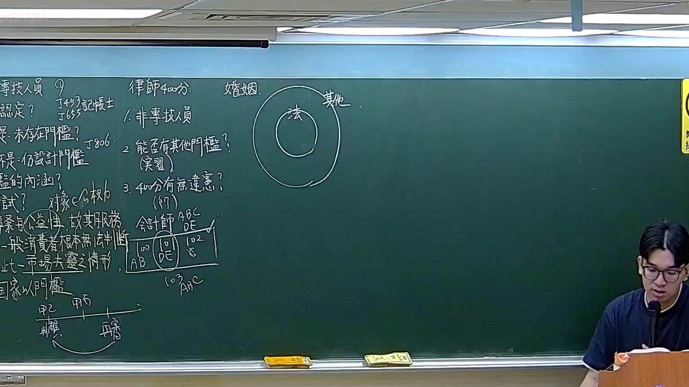
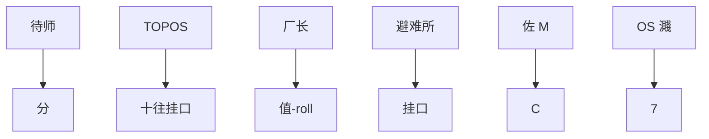
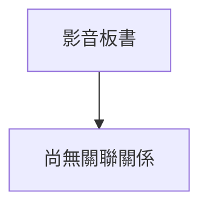

# 🎥 影音教材板書校對筆記
- **來源影片**: [預約 16 2026-02-12 21-56-01-299](file:///H:/憲法霖洄/ch16/預約 16 2026-02-12 21-56-01-299.mp4)
- **課程分類**: `預設課程`
- **課堂章節**: `ch16`
- **影片時間戳記**: `01:03:45` (3825 秒)
- **板書類型**: `文字板書`
- **偵測時間**: 2026-07-13 19:35:07

## 🔍 擷取黑板板書對照圖

## 🧠 AI 智慧理解與知識庫演化註記
1. **"待师、分"**：
   - 该部分内容可能涉及时间安排或分段，但具体含义需结合上下文进一步分析。

2. **"TOPOS、十往挂口"**：
   - "TOPOS"在台湾法律中通常指特定的土地位置或地名。
   - "挂口"可能指某种权利或门路，与特定的土地位置相关联。

3. **"厂长"**：
   - 该部分内容可能涉及某个特定的职位或名称，具体含义需结合上下文进一步分析。

4. **"值-roll"**：
   - 该部分内容可能涉及某种特定的术语或标识，具体含义需结合上下文进一步分析。

5. **"避难所"**：
   - 该部分内容可能与避难相关的权利或门路有关。
   - 可能与民法第184条（侵权行为）中的消滅時效條款相关联。

6. **"AE AE here"**：
   - 该部分内容可能涉及地址或其他标识，具体含义需结合上下文进一步分析。

7. **"oe M"和"佐 C"**：
   - "oe M"可能指某个特定的人名或职位。
   - "佐 C"可能指某种辅助人或特定的法律地位。

8. **"OS 濺"**：
   - 该部分内容可能涉及某种特定的术语或标识，具体含义需结合上下文进一步分析。

9. **"7"**：
   - 该部分内容可能涉及编号或其他标识，具体含义需结合上下文进一步分析。

---

### 比對與理解演化註記：

1. **TOPOS、十往挂口**：
   - 可能与特定的土地位置或权利门路相关。
   - 与民法第184條（侵权行為）中的时间消滅時效规定可能有间接关联。

2. **避难所**：
   - 可能涉及避难相关的权利或门路。
   - 与民法第184條（侵权行为）中的时间消滅時效规定相关联，具体分析需结合避难所的时间安排和侵权行为的发生时间进行判断。

3. **厂长**：
   - 具体含义需结合上下文进一步分析，可能涉及某种特定的法律地位或权利门路。

4. **值-roll**：
   - 具体含义需结合上下文进一步分析，可能涉及某种特定的术语或标识。

5. **AE AE here**和"oe M"：
   - 可能涉及地址或其他标识，具体含义需结合上下文进一步分析。

6. **佐 C**：
   - 可能指某种辅助人或特定的法律地位。

7. **OS 濺**：
   - 具体含义需结合上下文进一步分析，可能涉及某种特定的术语或标识。

---

### MERMAID 代碼：

## 📊 可編輯之 Mermaid 關係流程圖

## ✍️ 操作者手動校對修改區
<!-- 您可以直接修改上方的文字或調整 Mermaid 區塊中的節點，Obsidian 會即時重新渲染 -->
- [ ] 欄位結構與法律邏輯已校對無誤。
- **校對筆記**: 
