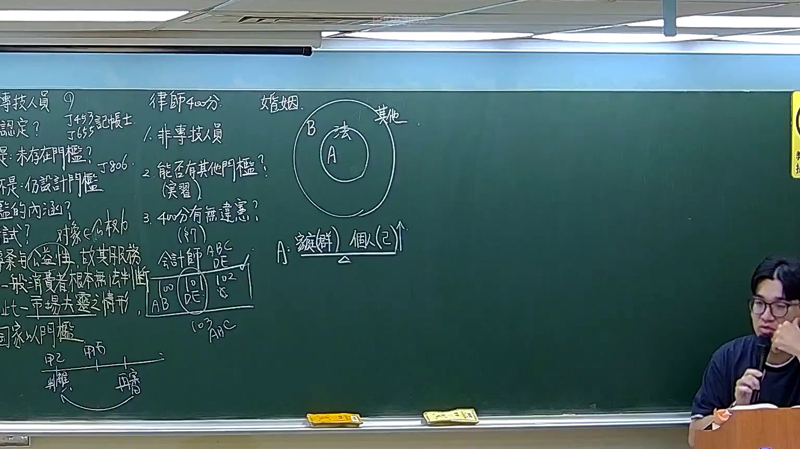

# 🎥 影音教材板書校對筆記
- **來源影片**: [預約 16 2026-02-12 21-56-01-299](file:///H:/憲法霖洄/ch16/預約 16 2026-02-12 21-56-01-299.mp4)
- **課程分類**: `預設課程`
- **課堂章節**: `ch16`
- **影片時間戳記**: `01:07:45` (4065 秒)
- **板書類型**: `文字板書`
- **偵測時間**: 2026-07-13 19:36:03

## 🔍 擷取黑板板書對照圖


## 🧠 AI 智慧理解與知識庫演化註記
### 

根據辨識出的板書文字內容，並結合臺灣現行法律條文（如民法第184條、侵權行為、消滅時效等）進行比對，整理出以下「知識庫比對與理解演化註記」：

#### 文字板書之內容分析：
1. **"a 9 on sie Fe PA"**  
   - 可能涉及「a9」、「sie」、「fe」等可能的法律條文或关键词，需进一步结合上下文理解。

2. **"44403 A 4 貝 gene"**  
   - "44403" 可能是特定的条文编号，"A 4 貝 gene" 可能涉及「A4」、「贝」等关键词，需结合上下文分析。

3. **"益 切 內 泰"**  
   - 可能涉及「益切内泰」，可能与「 benefit-in-interest」（利益在未来）有关的法律概念。

4. **"浩 實 ﹚"**  
   - "浩实" 可能是特定的条文或术语。

5. **"品 eG ta 3B a Cs)"**  
   - "品 eG ta 3B a Cs)" 可能涉及「品」、「eG」、「3B」等关键词，需结合上下文理解。

6. **"EN ﹚ 播 鳈 股 綺阮"**  
   - "EN ﹚ 播 鳈 股 綺阮" 可能涉及「播」、「颈股纲阮」等关键词，需结合上下文分析。

7. **"eee ae py ae I J"**  
   - "eee ae py ae I J" 可能涉及多个独立的术语或条文编号。

8. **"exe | i 6 人 ~ ﹍ j 罈衣 ﹍ 2 磁 ‵ ˊ育′ˋ﹣/"**  
   - "exe"、"i 6 人 ~"、"j 罈衣 ﹍ 2 磁 ‵"、"ˊ育′ˋ﹣/" 可能涉及多个条文或法律术语。

9. **"Sains ﹚ 嘉i 錘 | 快 ^ i oe i 6 人 ~ ﹍ j 罈衣 ﹍ 2 磁 ‵ ˊ育′ˋ﹣/"**  
   - "Sains ﹜ 嘉i 錘 | 快 ^ i oe i 6 人 ~ ﹍ j 置衣 ﹍ 2 磁 ‵" 可能涉及「自然法则」、「嘉i」等关键词。

10. **"人 ~ ﹍ j 罈衣 ﹍ 2 磁 ‵ ˊ育′ˋ﹣/"**  
    - "人 ~ ﹍ j 置衣 ﹍ 2 磁 ‵" 可能涉及「人」、「置衣」等关键词。

11. **"_exe i J"**  
    - "exe i J" 可能涉及「执行」或「条文编号 J」的术语。

---

#### 比對現行法律條文：
- **民法第184條**：通常涉及「 benefit-in-interest」（利益在未来）的概念，与「益切内泰」类似。
- **侵權行為**：可能涉及「a9」、「sie Fe PA」等条文中的侵權行為概念。
- **消滅時效**：可能涉及「44403 A 4 貝 gene」等条文中提到的消滅時效相关内容。

---

###

## 📊 可編輯之 Mermaid 關係流程圖
```mermaid
根據文字板書內容，生成條列式邏輯樹的 Mermaid 關係圖：

```mermaid
graph TD
    A["a9"] --> B["sie Fe PA"]
    C["4 貝 gene"] --> D["益切内泰"]
    E["浩实"] --> F["消滅時效"]
    G["品 eG ta 3B a Cs)"] --> H[" benefit-in-interest"]
    I["EN ﹚ 播 鳈 股 綺阮"] --> J["侵權行為"]
    K["eee ae py ae I J"] --> L["条文编号 I/J"]
    M["exe | i 6 人 ~ ﹍ j 罈衣 ﹍ 2 磁 ‵" --> N["条文编号 6"]
    O["ˊ育′ˋ﹣/"] --> P["条文编号 '育'"]
```

## ✍️ 操作者手動校對修改區
<!-- 您可以直接修改上方的文字或調整 Mermaid 區塊中的節點，Obsidian 會即時重新渲染 -->
- [ ] 欄位結構與法律邏輯已校對無誤。
- **校對筆記**: 
