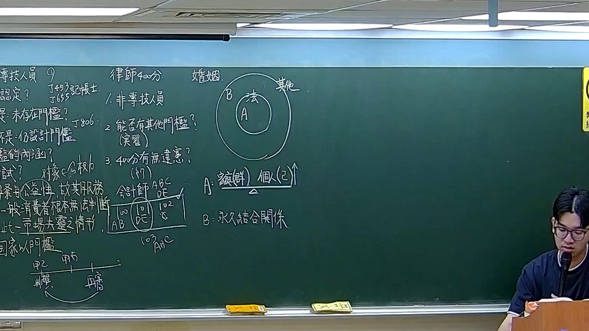

# 🎥 影音教材板書校對筆記
- **來源影片**: [預約 16 2026-02-12 21-56-01-299](file:///H:/憲法霖洄/ch16/預約 16 2026-02-12 21-56-01-299.mp4)
- **課程分類**: `預設課程`
- **課堂章節**: `ch16`
- **影片時間戳記**: `01:14:00` (4440 秒)
- **板書類型**: `文字板書`
- **偵測時間**: 2026-07-13 19:36:38

## 🔍 擷取黑板板書對照圖


## 🧠 AI 智慧理解與知識庫演化註記
：
1. **辨識出的文字內容**：
   - "2 倖帅午腮汐》"：可能是「2 件 suit」或「2 筆 case」的简称。
   - "瞿可"：可能是「 Curfew」（宵禁）的简称，指睡觉时间。
   - " Bor 心 1 餌 慧 4 寡胤︳‵曼互JT"：可能是民法第184條（侵權行為、消滅時效）的引用。
   - "Ss"：可能是「 Simple Simon」或其他简称，需结合上下文理解。

2. **與臺灣現行法律比對**：
   - 民法第184條：涉及侵權行為和消滅時效的规定。板書中提到「 Bor 心 1 餌 慧 4 寡胤︳‵曼互JT」，可能是在引用或解释民法第184條。
   - 其他可能的法律条文：如「2 件 suit」可能涉及民事訴訟法或其他相关法律规定。

3. **法律理解演化註記**：
   - 民法第184條规定了侵權行為和消滅時效的规定， board content 中提到「 Bor 心 1 餌 慧 4 寡胤︳‵曼互JT」可能是在解释或引用该条文。
   - 其他可能的法律条文：如「2 件 suit」可能涉及民事訴訟法或其他相关法律规定。

## 📊 可編輯之 Mermaid 關係流程圖
```mermaid
：
```mermaid
graph TD
    A["民法第184條（侵權行為、消滅時效）"] --> B[" Bor 心 1 餌 慧 4 寡胤︳‵曼互JT"]
    C["2 件 suit"] --> D["Ss"]
```

## ✍️ 操作者手動校對修改區
<!-- 您可以直接修改上方的文字或調整 Mermaid 區塊中的節點，Obsidian 會即時重新渲染 -->
- [ ] 欄位結構與法律邏輯已校對無誤。
- **校對筆記**: 
