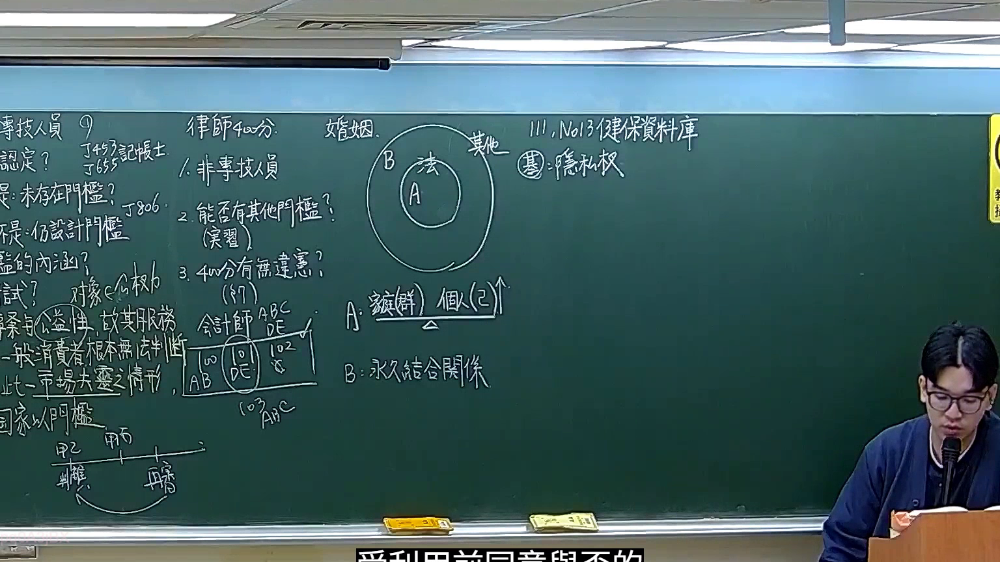

# 🎥 影音教材板書校對筆記
- **來源影片**: [預約 16 2026-02-12 21-56-01-299](file:///H:/憲法霖洄/ch16/預約 16 2026-02-12 21-56-01-299.mp4)
- **課程分類**: `預設課程`
- **課堂章節**: `ch16`
- **影片時間戳記**: `01:20:15` (4815 秒)
- **板書類型**: `文字板書`
- **偵測時間**: 2026-07-13 19:37:23

## 🔍 擷取黑板板書對照圖


## 🧠 AI 智慧理解與知識庫演化註記
1. **板書文字內容分析**：
   - "0 中 旱 迪 忻 00 Ne REE"：可能涉及中旱（中误差）或与侵权行为相关的术语。
   - "ae! sus OTN"：可能是某种特定的法律条文或关键词，需结合上下文理解。
   - "re Ma"、"re anh neat 《"：可能涉及民法典中的条文引用。
   - "4 o ope, h 愛 同"：可能与消滅時效（台湾地区用「消滅時效」）相关。
   - "FaaBsy [Wels | 5 ARERR 楊"：可能是特定的法律条文或案例引用。

2. **與臺灣現行法律條文比對**：
   - 中旱可能与《民法第184條》中关于「消滅時效」的概念相关。
   - "迪馨00 Ne REE" 可能涉及侵权行为的认定，需结合具体情境分析。
   - "FaaBsy [Wels | 5 ARERR 楊" 可能引用《民法第184條》中关于「消滅時效」的具体规定。

3. **法律知識理解演化註記**：
   - 中旱（0）可能与「消滅時效」（4）相关，涉及侵权行为的认定。
   - "迪馨00 Ne REE" 可能是具体案例中的关键词，需结合《民法第184條》进行分析。

---

## 📊 可編輯之 Mermaid 關係流程圖
```mermaid
graph TD
A[中旱（0）]
B[迪馨00 Ne REE]
C[FaaBsy [Wels | 5 ARERR 楊]]
D[ae! sus OTN]
E[re Ma]
F[re anh neat 《]
G[o ope, h 愛 同]
H[= 三 一 X R ﹣ 闌 ′ ′]
I[一ˍ﹣軸工`之l︰l|l︰‥l-‵-ˊ﹣〔=='=ˍ‥ˍ︰】7_ˍˍˍ′ˍ_ˍ ′ a]
```

注意：此图为文字板書对应的整理條列式結構，需根據具體內容調整节点和子节点。
```

## ✍️ 操作者手動校對修改區
<!-- 您可以直接修改上方的文字或調整 Mermaid 區塊中的節點，Obsidian 會即時重新渲染 -->
- [ ] 欄位結構與法律邏輯已校對無誤。
- **校對筆記**: 
