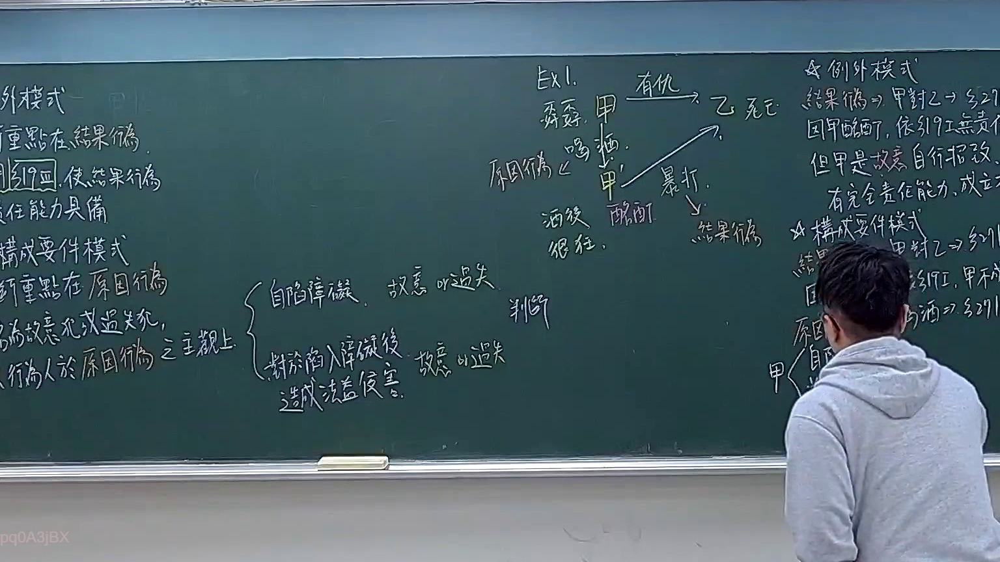
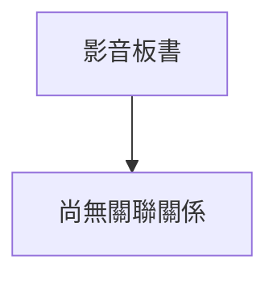

# 🎥 影音教材板書校對筆記
- **來源影片**: [預約 16 2026-03-05 22-36-41-728](file:///J://刑法B115/ch16/預約 16 2026-03-05 22-36-41-728.mp4)
- **課程分類**: `[刑法B115`
- **課堂章節**: `ch16]`
- **影片時間戳記**: `00:12:30` (750 秒)
- **板書類型**: `關係圖/邏輯圖板書`
- **偵測時間**: 2026-07-13 07:04:26

## 🔍 擷取黑板板書對照圖

## 🧠 AI 智慧理解與知識庫演化註記
您好！您的訊息中「擷取區域的 OCR 辨識字元如下：」之後**沒有貼上實際的文字內容**。

請將老師黑板上的 OCR 辨識字串貼上來，我才能立即為您完成以下工作：

1. **語意整理 + 法律條文比對註記**（如民法第416條預約、第259條解除權效果、第263條消滅時效等）
2. **Mermaid.js 流程圖代碼**（關係圖/邏輯圖結構化呈現）

---

📌 **範例格式供您參考：**

> OCR 字串：「甲與乙簽訂預約契約，約定於明年1月交付土地。乙未依約履行，甲得否解除？消滅時效為何？」

只要您貼上實際文字，我馬上為您處理！

## 📊 可編輯之 Mermaid 關係流程圖

## ✍️ 操作者手動校對修改區
<!-- 您可以直接修改上方的文字或調整 Mermaid 區塊中的節點，Obsidian 會即時重新渲染 -->
- [ ] 欄位結構與法律邏輯已校對無誤。
- **校對筆記**: 
