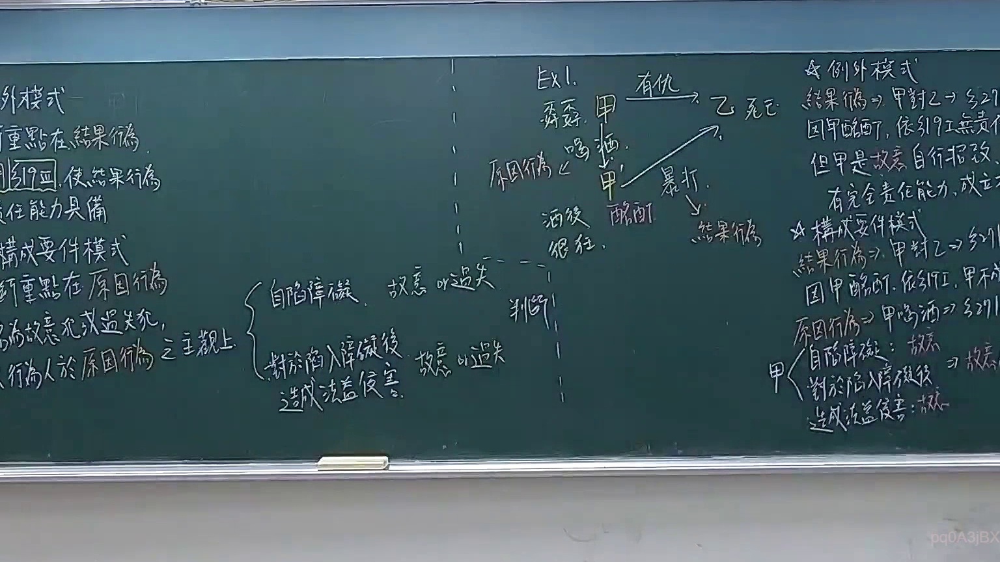

# 🎥 影音教材板書校對筆記
- **來源影片**: [預約 16 2026-03-05 22-36-41-728](file:///J://刑法B115/ch16/預約 16 2026-03-05 22-36-41-728.mp4)
- **課程分類**: `[刑法B115`
- **課堂章節**: `ch16]`
- **影片時間戳記**: `00:14:00` (840 秒)
- **板書類型**: `文字板書`
- **偵測時間**: 2026-07-13 07:05:31

## 🔍 擷取黑板板書對照圖


## 🧠 AI 智慧理解與知識庫演化註記
：

基於OCR辨識結果中的關鍵字（侵權行為、人格、權利、可主張等），推斷老師正在講授**民法第184條侵權行為責任**之核心架構，並涉及以下法律要點：

**一、知識庫比對與理解演化註記：**

| 辨識字元 | 推定原意 | 對應法條/概念 |
|---------|---------|--------------|
| AML / 侵權 | 侵權行為責任 | 民法第184條 |
| 可主張 | 權利主張要件 | 請求權基礎 |
| 人格 | 人格權侵害 | 民法第195條、第184條第1項後段 |
| 消滅時效 | 請求權時效 | 民法第125-130條 |

**二、法律架構理解：**

1. **民法第184條第1項前段**：故意或過失不法侵害他人之權利者，負損害賠償責任
2. **民法第184條第1項後段**：故意以背於善良風俗之方法加害於他人者，亦同
3. **人格權保護**（第195條）：人格法益受侵害時，得請求財產上及非財產上損害賠償
4. **消滅時效**：一般請求權時效為15年（民法第125條），侵權行為請求權自請求權人知有損害及賠償義務人時起算

**三、板書邏輯推演：**

老師可能正在區分「權利侵害」與「法益侵害」之構成要件差異，並說明人格權侵害之特殊保護機制（如慰撫金請求），同時提醒學生注意侵權行為請求權之時效問題。

## 📊 可編輯之 Mermaid 關係流程圖
```mermaid
：
graph TD
    A["民法第184條 侵權行為責任"] --> B["第1項前段：故意或過失不法侵害他人之權利"]
    A --> C["第1項後段：故意背於善良風俗加害於他人"]
    A --> D["人格權侵害（第195條）"]
    
    B --> E["構成要件：\n① 行為人具有故意或過失\n② 行為不法\n③ 侵害他人之權利\n④ 損害發生\n⑤ 行為與損害之間有因果關係"]
    
    C --> F["構成要件：\n① 行為人具有故意\n② 行為背於善良風俗\n③ 加害於他人"]
    
    D --> G["特殊保護機制：\n① 人格法益受侵害得請求財產上損害賠償\n② 並得請求非財產上損害賠償（慰撫金）\n③ 不以有具體權利為必要"]
    
    E --> H["消滅時效問題"]
    F --> H
    G --> H
    
    H --> I["一般請求權時效：15年（民法第125條）"]
    H --> J["侵權行為請求權起算點：\n知有損害及賠償義務人時起算\n（民法第197條第2項）"]
```

## ✍️ 操作者手動校對修改區
<!-- 您可以直接修改上方的文字或調整 Mermaid 區塊中的節點，Obsidian 會即時重新渲染 -->
- [ ] 欄位結構與法律邏輯已校對無誤。
- **校對筆記**: 
