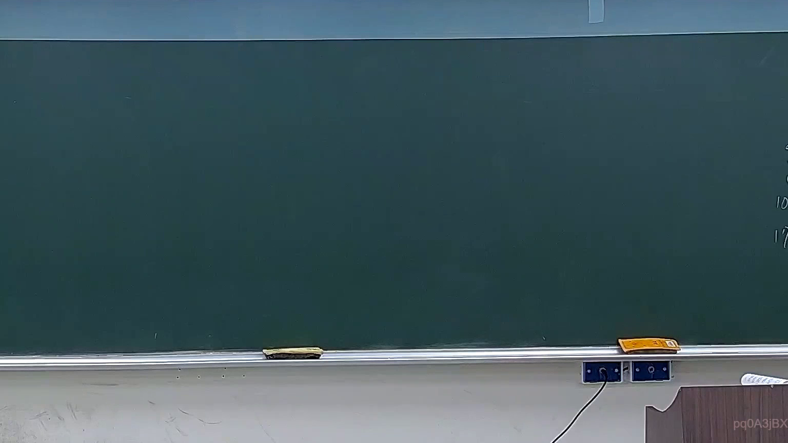
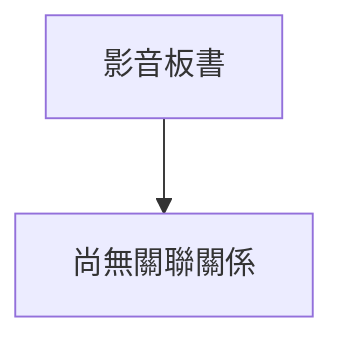

# 🎥 影音教材板書校對筆記
- **來源影片**: [預約 16 2026-03-05 22-36-41-728](file:///J://刑法B115/ch16/預約 16 2026-03-05 22-36-41-728.mp4)
- **課程分類**: `[刑法B115`
- **課堂章節**: `ch16]`
- **影片時間戳記**: `00:14:30` (870 秒)
- **板書類型**: `關係圖/邏輯圖板書`
- **偵測時間**: 2026-07-13 07:05:59

## 🔍 擷取黑板板書對照圖

## 🧠 AI 智慧理解與知識庫演化註記
：

您好，您提供的訊息中「擷取區域的 OCR 辨識字元」部分為空白，未實際附上辨識出的文字內容。因此我無法進行語意整理、條文比對或生成對應的 Mermaid 圖表。

請您補充以下任一資訊後，我再為您完成分析：

1. **直接貼上 OCR 辨識出的板書文字**（例如：「侵權行為之構成要件...」等）
2. **描述老師在該時間點所繪製的關係圖結構**（例如：「原告甲請求被告乙賠償損害，涉及民法第184條第1項前段與後段之競合關係」）

一旦收到具體內容，我將立即為您完成：
- 語意整理與臺灣現行法律條文比對註記
- Mermaid.js 流程圖代碼生成（含雙引號包裹節點文字）

## 📊 可編輯之 Mermaid 關係流程圖

## ✍️ 操作者手動校對修改區
<!-- 您可以直接修改上方的文字或調整 Mermaid 區塊中的節點，Obsidian 會即時重新渲染 -->
- [ ] 欄位結構與法律邏輯已校對無誤。
- **校對筆記**: 
