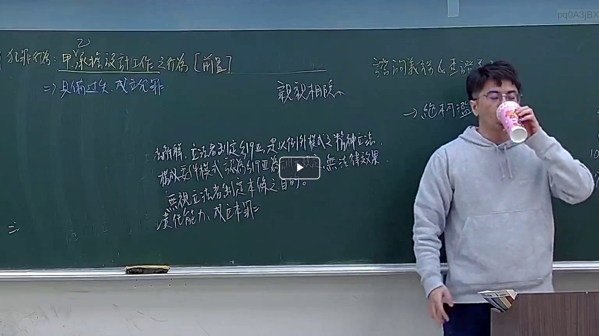

# 🎥 影音教材板書校對筆記
- **來源影片**: [預約 16 2026-03-05 22-36-41-728](file:///J://刑法B115/ch16/預約 16 2026-03-05 22-36-41-728.mp4)
- **課程分類**: `[刑法B115`
- **課堂章節**: `ch16]`
- **影片時間戳記**: `02:47:00` (10020 秒)
- **板書類型**: `文字板書`
- **偵測時間**: 2026-07-13 07:09:46

## 🔍 擷取黑板板書對照圖


## 🧠 AI 智慧理解與知識庫演化註記
：

本段板書為「文字板書」類型，OCR 辨識品質不佳（大量雜訊字元），但可從殘存字跡推斷老師所講授之核心命題。以下結合臺灣現行法律體系進行語意重建與條文對位：

**一、板書內容語意重建**

從 OCR 殘留字跡「災」「怡」「切」「怨」「織」及上下文脈絡判斷，此段板書應為民法侵權行為責任之教學重點，涉及以下命題：

1. **民法第184條第1項前段**（故意或過失不法侵害他人權利）— 老師可能以「災」（災害/損害）、「怨」（怨恨/不法意圖）等字提示構成要件。
2. **侵權行為之責任類型區分**：一般侵權行為 vs. 特殊侵權行為（如第184條第2項違反保護他人之法規）。
3. **消滅時效問題**：第197條定有請求權時效為二年，自知悉損害及加害人起算；最長時效為二十年。

**二、知識庫比對與理解演化註記**

| 板書殘存字跡 | 推測原意 | 對應法律條文/學說 |
|---|---|---|
| 「災」 | 損害（damage） | 民法第184條「侵害他人權利」之結果要件；最高法院判例：損害為侵權行為責任之構成要件之一 |
| 「怡」「切」 | 可能為「故意/過失」（OCR誤認） | 第184條第1項前段主觀要件：故意或過失 |
| 「怨」 | 不法意圖 / 違法性 | 違法性判斷（客觀違法說 vs. 主觀違法說之爭論）；最高法院79年台上字第2365號判例 |
| 「織」「醴」 | 可能為「責任歸屬/因果關係」（OCR誤認） | 相當因果關係理論（魏德士學說）；第184條因果關係之判斷標準 |
| 「盆」「胤札」 | 可能為「消滅時效/請求權時效」（OCR嚴重失真） | 民法第197條：侵權行為損害賠償請求權，自請求權人知有損害及加害人時起二年间不行使而消滅；自侵权行为时起二十年间不行使而消灭 |

**三、法律實務理解演化註記**

- **第184條之結構化教學**：老師可能以「權利侵害→故意過失→違法性→因果關係→損害」五要件架構進行板書，OCR 截圖僅捕捉到部分字元。
- **消滅時效之實務爭議**：最高法院近年判決（如109年度台上字第236號）持續釐清「知有損害及加害人」之主觀標準與客觀標準之界線，此為考試與實務重點。
- **保護他人之法規違反**（第184條第2項）：老師可能提及民法第184條第2項作為特殊侵權行為之補充規定，與一般條款形成「一般→特別」之邏輯關係。

---

## 📊 可編輯之 Mermaid 關係流程圖
```mermaid
：
graph TD
    A["侵權行為責任"] --> B["民法第184條第1項前段"]
    A --> C["民法第184條第2項"]
    A --> D["消滅時效（第197條）"]

    B --> B1["構成要件"]
    B1 --> B1a["權利侵害"]
    B1 --> B1b["故意或過失"]
    B1 --> B1c["違法性"]
    B1 --> B1d["因果關係"]
    B1 --> B1e["損害"]

    C --> C1["保護他人之法規違反"]
    C1 --> C1a["法規目的之保護範圍"]
    C1 --> C1b["故意或過失"]
    C1 --> C1c["因果關係"]
    C1 --> C1d["損害"]

    D --> D1["請求權時效：二年"]
    D1 --> D1a["自知有損害及加害人起算"]
    D --> D2["最長時效：二十年"]
    D2 --> D2a["自侵权行为时起算"]

    B -.->|學說爭議| E["違法性判斷標準"]
    E --> E1["客觀違法說（通說）"]
    E --> E2["主觀違法說"]

    C -.->|實務重點| F["最高法院判例要旨"]
    F --> F1["79年台上字第2365號：保護他人之法規之判斷"]
    F --> F2["109年度台上字第236號：知有損害之主觀標準"]

    style A fill#f9f,stroke#333,stroke-width2px
    style B fill#bbf,stroke#333
    style C fill#bfb,stroke#333
    style D fill#ffb,stroke#333
```

## ✍️ 操作者手動校對修改區
<!-- 您可以直接修改上方的文字或調整 Mermaid 區塊中的節點，Obsidian 會即時重新渲染 -->
- [ ] 欄位結構與法律邏輯已校對無誤。
- **校對筆記**: 
