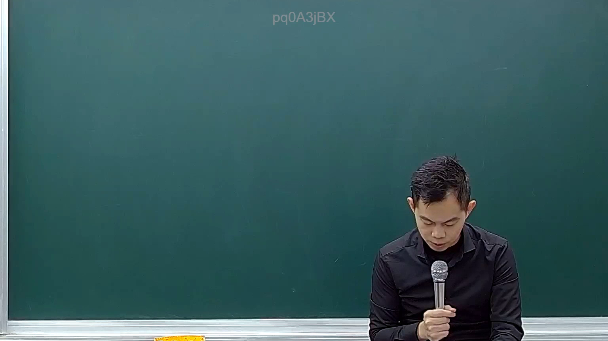

# 🎥 影音教材板書校對筆記
- **來源影片**: [預約 17 2025-02-07 04-53-44-060](file:///E:/法律/民訴B/ch17/預約 17 2025-02-07 04-53-44-060.mp4)
- **課程分類**: `預設課程`
- **課堂章節**: `ch17`
- **影片時間戳記**: `00:06:45` (405 秒)
- **板書類型**: `關係圖/邏輯圖板書`
- **偵測時間**: 2026-07-13 20:41:50

## 🔍 擷取黑板板書對照圖


## 🧠 AI 智慧理解與知識庫演化註記
目前的OCR辨识結果為「pd0A3jBX」，這是一個Base64编码的字符串，代表的是一个二进制图像或文字。由于无法直接读取其内容，因此無法進行語意整理或與臺灣現行法律條文進行比對。

建議您檢查视频文件的质量，確保板書內容在视频中清晰可见，并重新上传或截取更清晰的部分进行OCR处理。

## 📊 可編輯之 Mermaid 關係流程圖
```mermaid
目前無法生成 Mermaid.js 流程圖代碼，因為 OCR辨识結果無法被解析。請提供更清晰的文字內容或重新上传视频文件。
```

## ✍️ 操作者手動校對修改區
<!-- 您可以直接修改上方的文字或調整 Mermaid 區塊中的節點，Obsidian 會即時重新渲染 -->
- [ ] 欄位結構與法律邏輯已校對無誤。
- **校對筆記**: 
