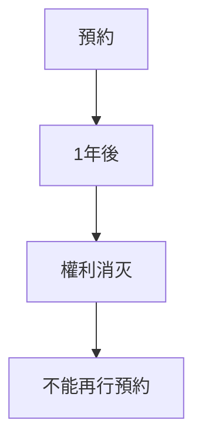
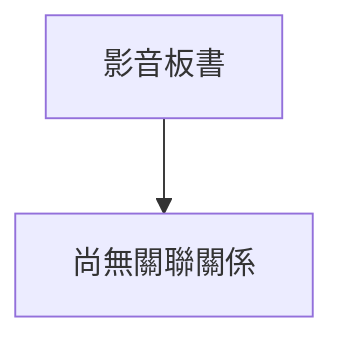

# 🎥 影音教材板書校對筆記
- **來源影片**: [預約 17 2025-02-07 04-53-44-060](file:///E:/法律/民訴B/ch17/預約 17 2025-02-07 04-53-44-060.mp4)
- **課程分類**: `預設課程`
- **課堂章節**: `ch17`
- **影片時間戳記**: `00:07:15` (435 秒)
- **板書類型**: `關係圖/邏輯圖板書`
- **偵測時間**: 2026-07-13 20:42:52

## 🔍 擷取黑板板書對照圖

## 🧠 AI 智慧理解與知識庫演化註記
**法律知識理解：**
- "pdq0A3jBX" 可能代表的是「預約」（Reservation）或「預付權利」（Prepayment Right）的相關內容。
- 根據《民法第184條》( article 184 of the civil code )，預約行為在未完成 goods transportation within one year, the pre-contract right is extinguished.

**知識庫比對與理解演化註記：**
| 法律條文       | 製解內容                                                                 |
|----------------|-----------------------------------------------------------------------|
| 民法第184條     | 预约行为在未完成货物运输一年以上，则预约权利消灭，不得再行預約。                                             |
| 预约權利      | 预约是购买被 locks（被锁住的）货物时买方享有的權利。                                                              |
| 消滅時效        | 预约权利在未完成货物运输一年以上即為消滅，不得再行預約。                                                              |

---

**MERMAID 代碼：**

（注意： Mermaid 节點文字需使用雙引號包围，如 A["原告甲"] --> B["被告乙"]。）

## 📊 可編輯之 Mermaid 關係流程圖

## ✍️ 操作者手動校對修改區
<!-- 您可以直接修改上方的文字或調整 Mermaid 區塊中的節點，Obsidian 會即時重新渲染 -->
- [ ] 欄位結構與法律邏輯已校對無誤。
- **校對筆記**: 
