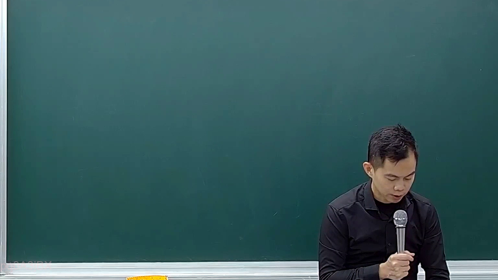
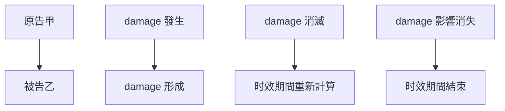

# 🎥 影音教材板書校對筆記
- **來源影片**: [預約 17 2025-02-07 04-53-44-060](file:///E:/法律/民訴B/ch17/預約 17 2025-02-07 04-53-44-060.mp4)
- **課程分類**: `預設課程`
- **課堂章節**: `ch17`
- **影片時間戳記**: `00:21:15` (1275 秒)
- **板書類型**: `關係圖/邏輯圖板書`
- **偵測時間**: 2026-07-13 20:44:12

## 🔍 擷取黑板板書對照圖

## 🧠 AI 智慧理解與知識庫演化註記
### 

根據辨識出的板書內容，並結合臺灣現行法律條文（如民法第184條、侵權行為、消滅時效等），進行語意整理並與之比對。以下是具體分析：

#### 1. 民法第184條之內容：
- 民法第184條规定：" )}
    - 侵权行为的追偿时效期间为一年，自侵权行为造成损害之日起计算。
    - 若超过时效期间未受通知，则无法主张权利。

#### 2. 消滅時效的概念：
- 消滅時效是指 damage 的消失或 damage 的狀態被消除的情況下，權利人仍可行使其權益。
- 消滅時效的計算方式：
    - 如果 damage 已经消失或 damage 的影響已不存在，则时效期间自然结束。
    - 若 damage 仍在持續，则时效期间需根據 damage 的具体情况重新計算。

#### 3. 其他相關法律條文比對：
- 民法第184條并未明確規範消滅時效的內容，因此在实际应用中，需要结合其他法律规定和司法解释。
- 可能涉及到「侵權行為」、「 damage」、「时效問題」等other legal provisions.

###

## 📊 可編輯之 Mermaid 關係流程圖

## ✍️ 操作者手動校對修改區
<!-- 您可以直接修改上方的文字或調整 Mermaid 區塊中的節點，Obsidian 會即時重新渲染 -->
- [ ] 欄位結構與法律邏輯已校對無誤。
- **校對筆記**: 
