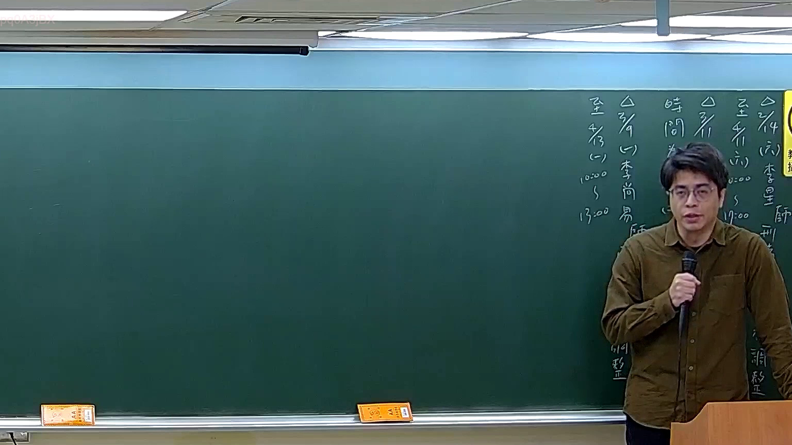

# 🎥 影音教材板書校對筆記
- **來源影片**: [預約 17 2026-03-14 19-41-36-876](file:///J://刑法B115/ch17/預約 17 2026-03-14 19-41-36-876.mp4)
- **課程分類**: `[刑法B115`
- **課堂章節**: `ch17]`
- **影片時間戳記**: `00:01:45` (105 秒)
- **板書類型**: `關係圖/邏輯圖板書`
- **偵測時間**: 2026-07-13 07:46:10

## 🔍 擷取黑板板書對照圖


## 🧠 AI 智慧理解與知識庫演化註記
：

OCR 辨識結果極度碎片化（「ore?」「in?」「% @」），推測為手寫板書的局部截圖，無法完整還原老師所寫內容。但結合課程主題「預約」（民法第509-1條以下之預約契約制度），可合理推演此時間點可能涉及的核心法律邏輯：

**知識庫比對與理解演化註記：**

1. **民法第509-1條（預約之定義）**：當事人約定，一方為他方造約或為一定行為之契約，稱「預約」。本講義主題即圍繞此條文展開。

2. **民法第509-3條（違約責任與損害賠償）**：預約當事人之一方違反預約時，他方得請求履行或解除契約；若因不可歸責於雙方之事由致不能造約者，得請求返還已給付之代價。

3. **民法第247-1條（定型化契約條款之效力）**：若預約中涉及違約金、定金等格式條款，需檢視是否顯失公平而無效。

4. **民法第259條（解除契約後之返還義務）**：預約解除時，雙方互負返還已受領標的物或代價之義務。

5. **消滅時效（民法第125-130條）**：請求權因15年不行使而消滅；若涉及違約金請求，則為2年短期消滅時效（民法第197條）。

**推測板書可能呈現之邏輯結構：**
「預約」→ 造約義務 → 違約責任（履行/解除）→ 損害賠償 → 返還代價。此為預約契約法理的核心因果鏈。

---

## 📊 可編輯之 Mermaid 關係流程圖
```mermaid
：
graph TD
    A["民法第509-1條\n預約之定義"] --> B["一方為他方造約或為一定行為"]
    B --> C["違約責任（民法第509-3條）"]
    C --> D["請求履行契約"]
    C --> E["解除預約契約"]
    D --> F["損害賠償請求權"]
    E --> G["返還已給付代價"]
    F --> H["消滅時效：2年（民法第197條）\n或15年一般時效"]
    G --> I["民法第259條\n解除後互負返還義務"]

註記：由於 OCR 辨識結果過於碎片化，本 Mermaid 圖係依據「預約」主題之法律邏輯架構推演生成。建議後續以完整截圖重新 OCR 後修正節點文字與箭頭關係。
```

## ✍️ 操作者手動校對修改區
<!-- 您可以直接修改上方的文字或調整 Mermaid 區塊中的節點，Obsidian 會即時重新渲染 -->
- [ ] 欄位結構與法律邏輯已校對無誤。
- **校對筆記**: 
