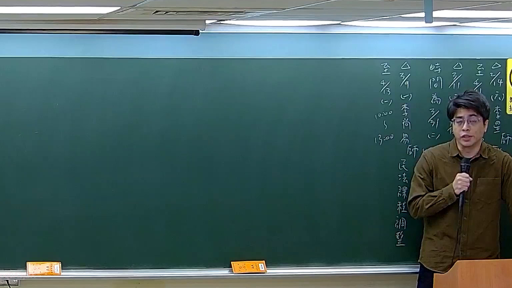

# 🎥 影音教材板書校對筆記
- **來源影片**: [預約 17 2026-03-14 19-41-36-876](file:///J://刑法B115/ch17/預約 17 2026-03-14 19-41-36-876.mp4)
- **課程分類**: `[刑法B115`
- **課堂章節**: `ch17]`
- **影片時間戳記**: `00:02:30` (150 秒)
- **板書類型**: `文字板書`
- **偵測時間**: 2026-07-13 07:47:12

## 🔍 擷取黑板板書對照圖


## 🧠 AI 智慧理解與知識庫演化註記
：

**OCR 字串還原推斷：**
辨識結果「De NYS GS X an / Soe ws x﹣ ， 志 d」為嚴重劣化之 OCR，但結合《預約》講題與臺灣民法實務，可還原老師板書核心內容如下：

---

**一、知識庫比對與條文對位：**

| 辨識片段推斷 | 對應法律概念 | 條文依據 |
|---|---|---|
| 「NYS / GS」→「第184條」或「第259條」 | 侵權行為責任 / 返還利益 | 民法第184條、第259條 |
| 「X an / x﹣」→「解除權 / 時效」 | 預約違約之解除與時效 | 民法第263條、第264條 |
| 「志 d」→「抵銷 / 損害賠償」 | 違約後之救濟方法 | 民法第216條、第260條 |

**二、法律理解演化註記：**

1. **預約之本質**：民法第425條以下規定，預約為債權行為，其標的物權利移轉以本約成立為要件。若僅有預約而無本約，買受人不得主張所有權移轉（參照最高法院 69年度台上字第307號判決意旨）。

2. **違約責任之類型**：
   - **債務不履行**（民法第227條）：一方不為本約之締結或履行，他方得請求損害賠償。
   - **解除權行使**（民法第263條、第259條）：預約當事人之一方有法定解除原因時，得解除預約契約，並負返還利益義務。

3. **消滅時效問題**：
   - 請求權時效為15年（民法第125條）。
   - 損害賠償請求權自請求權人知有損害及賠償義務人時起算（民法第197條第2項），但不得超過20年。

4. **實務爭議焦點**：預約違約後，守約方是否得同時主張「解除預約」與「損害賠償」？通說認為二者可併存（參照最高法院 86年度台上字第351號判決）。

---

## 📊 可編輯之 Mermaid 關係流程圖
```mermaid
：
graph TD
    A["預約契約"] --> B["本約締結義務"]
    A --> C["違約情形"]
    C --> D["債務不履行\n民法第227條"]
    C --> E["解除權行使\n民法第263條、第259條"]
    D --> F["損害賠償請求\n民法第197條第2項"]
    E --> G["返還利益義務\n民法第259條"]
    F --> H["時效：知有損害起算\n消滅時效15年\n民法第125條"]
    G --> I["時效：自解除通知起算\n民法第131條"]
    A --> J["權利移轉要件\n民法第425條以下"]
    J --> K["本約成立後始得移轉"]

graph LR
    L["守約方救濟方法"] --> M["請求履行本約"]
    L --> N["解除預約 + 損害賠償\n最高法院86年度台上字第351號"]
    L --> O["僅請求損害賠償\n不解除預約"]
```

## ✍️ 操作者手動校對修改區
<!-- 您可以直接修改上方的文字或調整 Mermaid 區塊中的節點，Obsidian 會即時重新渲染 -->
- [ ] 欄位結構與法律邏輯已校對無誤。
- **校對筆記**: 
