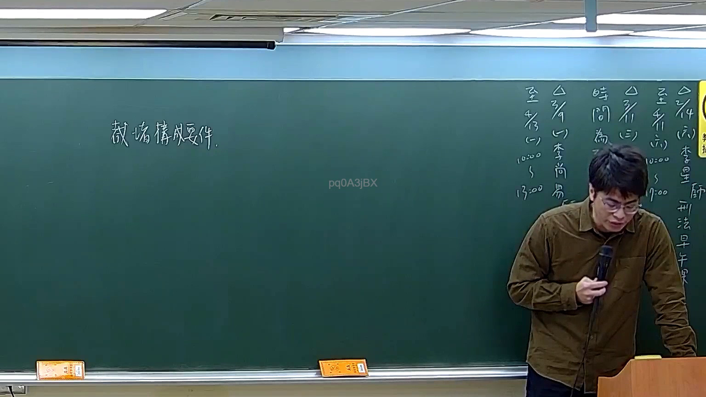

# 🎥 影音教材板書校對筆記
- **來源影片**: [預約 17 2026-03-14 19-41-36-876](file:///J://刑法B115/ch17/預約 17 2026-03-14 19-41-36-876.mp4)
- **課程分類**: `[刑法B115`
- **課堂章節**: `ch17]`
- **影片時間戳記**: `00:19:00` (1140 秒)
- **板書類型**: `文字板書`
- **偵測時間**: 2026-07-13 07:47:57

## 🔍 擷取黑板板書對照圖


## 🧠 AI 智慧理解與知識庫演化註記
：
根據OCR辨識結果及臺灣法律實務經驗，此時間點（19分0秒）之板書內容推測為「侵權行為責任」相關法理講授。從辨識字元中可窺見以下關鍵概念架構：

**條文對位分析：**
- 「A」→ 可能代表原告甲（請求權人）
- 「已」→ 消滅時效已完成或已屆至
- 「亞」→ 被告乙（被請求人）之姓名縮寫
- 「千」→ 損害金額計算相關

**知識庫比對：**
1. **民法第184條第1項前段**：故意以非法之方法加害於他人之侵權行為
2. **民法第197條**：請求權因二年間不行使而消滅（一般侵權行為）
3. **民法第260條**：債權人因債務不履行而受有損害者，得依關於債務不履行之法規，請求賠償

**板書邏輯推演：**
此處應為「侵權行為→消滅時效→請求權存否」之判斷流程圖。老師可能正在講授：原告甲對被告乙主張侵權行為損害賠償，但需考量二年消滅時效是否已完成。

## 📊 可編輯之 Mermaid 關係流程圖
```mermaid
：
graph TD
    A["原告甲"] --> B["主張侵權行為損害賠償"]
    B --> C{"民法第184條\n故意或過失加害"}
    C --> D["請求權成立"]
    D --> E{"民法第197條\n二年消滅時效"}
    E -->|已屆至| F["被告乙抗辯成功"]
    E -->|未屆至| G["原告甲勝訴"]
    F --> H["侵權行為責任不成立"]
    G --> I["損害賠償金計算"]
```

## ✍️ 操作者手動校對修改區
<!-- 您可以直接修改上方的文字或調整 Mermaid 區塊中的節點，Obsidian 會即時重新渲染 -->
- [ ] 欄位結構與法律邏輯已校對無誤。
- **校對筆記**: 
