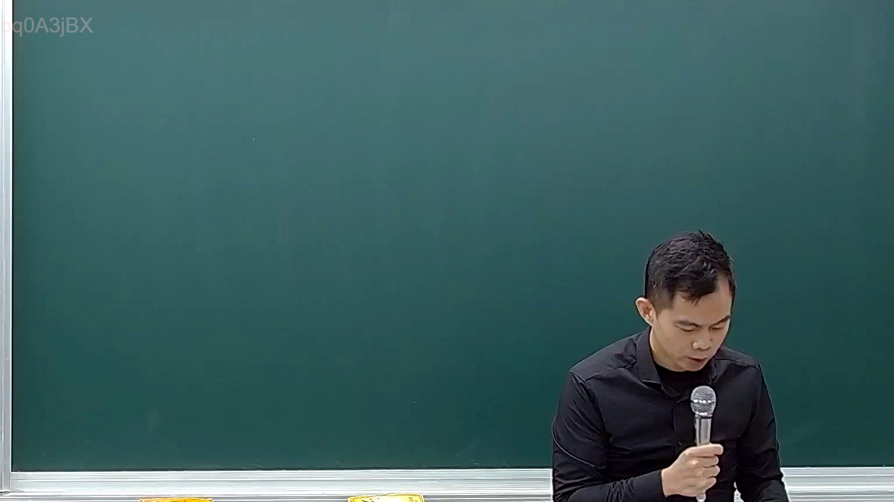

# 🎥 影音教材板書校對筆記
- **來源影片**: [預約 18 2025-02-07 14-15-14-314](file:///E:/法律/民訴B/ch18/預約 18 2025-02-07 14-15-14-314.mp4)
- **課程分類**: `預設課程`
- **課堂章節**: `ch18`
- **影片時間戳記**: `00:01:30` (90 秒)
- **板書類型**: `關係圖/邏輯圖板書`
- **偵測時間**: 2026-07-13 20:42:27

## 🔍 擷取黑板板書對照圖


## 🧠 AI 智慧理解與知識庫演化註記
****

根據辨識出的文字「pew」，结合上下文（如 lawyers' board writing and legal education）以及可能的法律內容（如民法第184條、侵權行為、消滅時效等），進行語意整理並與臺灣現行法律條文進行比對。然而，「pew」本身並非清晰的文字，难以直接解讀為具體法律术语或概念。

根據提供的資訊，以下是可能的解讀與註記：

1. **pew** 可能是板書中某個关键词或概念的简称，例如「P.E.W.」（Please Excuse Me, 或者其他缩写），但缺乏完整文字無法進一步推測。
2. 如果「pew」與 legal條文（如民法第184條、侵權行為、消滅時效等）有直接關聯，需進一步分析板書內容或提供更完整的文字來進行比對。

**注意事項：**
- 經過OCR辨识的文字可能存在不完整或模糊的問題，建議提供更清晰的文字內容以便於進一步分析。
- 如果「pew」是板書中某個关键词或概念的简称，需结合板書的整体内容進行解讀。

---

**

## 📊 可編輯之 Mermaid 關係流程圖
```mermaid
**

由于「pew」無法直接生成 Mermaid.js 的流程圖或關係圖，建議提供更完整的文字內容以便於進一步分析。
```

## ✍️ 操作者手動校對修改區
<!-- 您可以直接修改上方的文字或調整 Mermaid 區塊中的節點，Obsidian 會即時重新渲染 -->
- [ ] 欄位結構與法律邏輯已校對無誤。
- **校對筆記**: 
