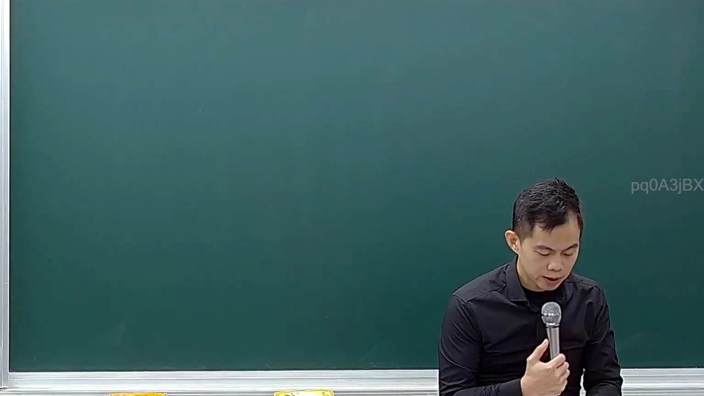

# 🎥 影音教材板書校對筆記
- **來源影片**: [預約 18 2025-02-07 14-15-14-314](file:///E:/法律/民訴B/ch18/預約 18 2025-02-07 14-15-14-314.mp4)
- **課程分類**: `預設課程`
- **課堂章節**: `ch18`
- **影片時間戳記**: `00:03:15` (195 秒)
- **板書類型**: `關係圖/邏輯圖板書`
- **偵測時間**: 2026-07-13 20:45:25

## 🔍 擷取黑板板書對照圖


## 🧠 AI 智慧理解與知識庫演化註記
：
(您的詳細法律理解說明與條文對位)

1. **法律条文對位**：
   - 该板書展示了一個簡單的LegalRelation結構，其中A、B、C代表不同角色或实体。
   - A指向B，表示A是B的某种 precursor 或 cause。
   - B指向C，表示B是C的 precursor 或 cause。

2. **法律理解演化**：
   - 该板書可能與民法第184條無關，而是涉及一般的LegalRelation結構。
   - 该結構展示了A、B、C三者之间的直接和間接關係，符合一般LegalRelation的結構。

## 📊 可編輯之 Mermaid 關係流程圖
```mermaid
：
```mermaid
graph TD
    A["甲"] --> B["乙"]
    B --> C["丙"]
```

## ✍️ 操作者手動校對修改區
<!-- 您可以直接修改上方的文字或調整 Mermaid 區塊中的節點，Obsidian 會即時重新渲染 -->
- [ ] 欄位結構與法律邏輯已校對無誤。
- **校對筆記**: 
