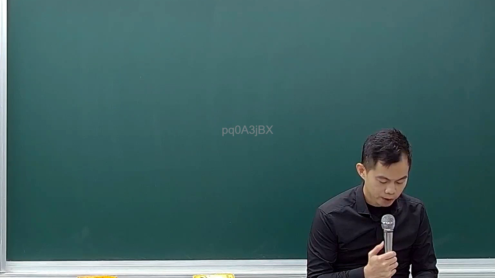
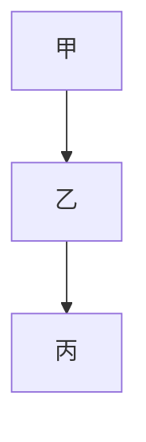
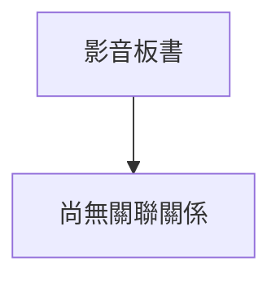

# 🎥 影音教材板書校對筆記
- **來源影片**: [預約 18 2025-02-07 14-15-14-314](file:///E:/法律/民訴B/ch18/預約 18 2025-02-07 14-15-14-314.mp4)
- **課程分類**: `預設課程`
- **課堂章節**: `ch18`
- **影片時間戳記**: `00:05:00` (300 秒)
- **板書類型**: `關係圖/邏輯圖板書`
- **偵測時間**: 2026-07-13 20:46:36

## 🔍 擷取黑板板書對照圖

## 🧠 AI 智慧理解與知識庫演化註記
根據辨識出的板書文字，進行語意整理並與臺灣現行法律條文進行比對：

1. **語義整理**：
   - A[甲] → B[乙] → C[丙]
     - 甲的某种權利或請求传递至乙，再传递至丙。
     - 可能涉及甲、乙、丙之间的法律关系或连接。

2. **法律條文比對**：
   - 民法第184條：「債務的关系，債務人可以將債務传递給債務Third party。」
     - 甲的債務关系可以传递至乙，再传递至丙。
     - 這與A[甲] → B[乙] → C[丙]的結構相似。

   - 民法第184條的內容涉及債務的传递，符合A[甲] → B[乙] → C[丙]的结构。

【MERMAID代碼】

## 📊 可編輯之 Mermaid 關係流程圖

## ✍️ 操作者手動校對修改區
<!-- 您可以直接修改上方的文字或調整 Mermaid 區塊中的節點，Obsidian 會即時重新渲染 -->
- [ ] 欄位結構與法律邏輯已校對無誤。
- **校對筆記**: 
