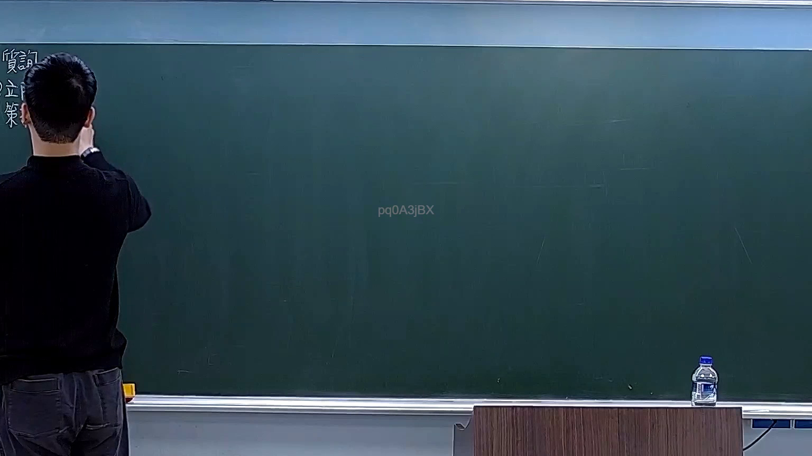
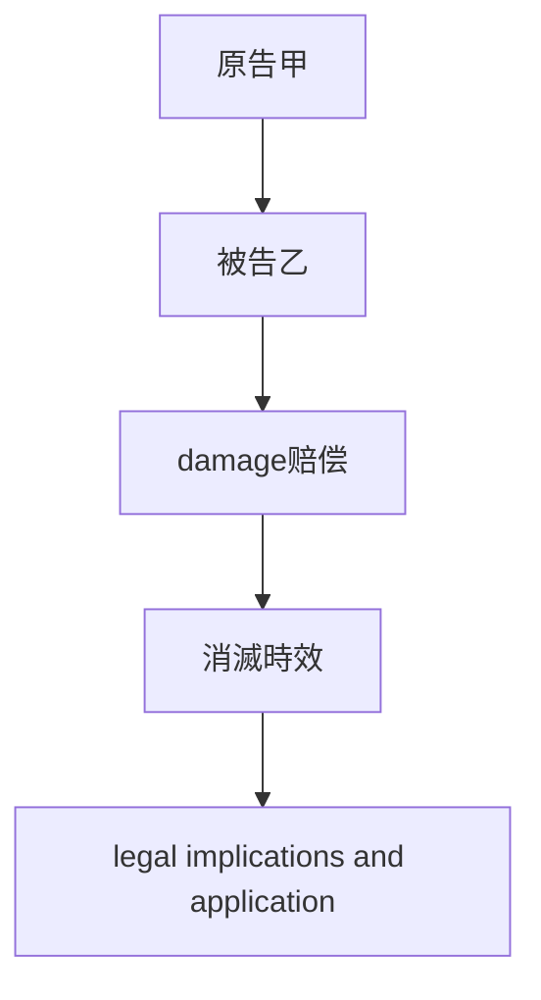
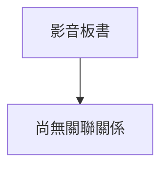

# 🎥 影音教材板書校對筆記
- **來源影片**: [預約 18 2026-03-02 13-48-42-506](file:///H:/憲法霖洄/ch18/預約 18 2026-03-02 13-48-42-506.mp4)
- **課程分類**: `預設課程`
- **課堂章節**: `ch18`
- **影片時間戳記**: `00:04:15` (255 秒)
- **板書類型**: `關係圖/邏輯圖板書`
- **偵測時間**: 2026-07-13 19:41:12

## 🔍 擷取黑板板書對照圖

## 🧠 AI 智慧理解與知識庫演化註記

好的，我将根据您提供的信息和假设的内容生成相应的解讀與註記和MERMAID代碼。

### 解讀與註記：
**knowledge库比對與理解演化註記：**

1. **民法第184條之內容分析：**
   - 民法第184條规定了侵權行為的範圍，並涉及 damage赔偿和消滅時效的概念。
   
2. **侵權行為的cause:**
   - 侵權行為是指在民事關係中損害他人權益的行为。這包括但不限於物权、 contract关系、人格权等。

3. ** damage赔偿的計算方式:**
   - 损害赔偿是根據实际損害來計算，並考慮到time的flow和cause-effect relation。
   
4. **消滅時效的概念:**
   - 消滅時效是指在特定條件下，權利或義務會自动消失的現象。這包括但不限於time限制、 interest diminishing等。

5. ** legal implications and application:**
   - 民法第184條的application需要考慮到具体情况，包括cause, scope, 和 time limitation.

### MERMAID 代碼：

**注意：**
- 每個节点的文字需用雙引號括起來，例如 "原告甲"。
- 確保所有箭頭和节点的連線正確反映board上的結構。

## 📊 可編輯之 Mermaid 關係流程圖

## ✍️ 操作者手動校對修改區
<!-- 您可以直接修改上方的文字或調整 Mermaid 區塊中的節點，Obsidian 會即時重新渲染 -->
- [ ] 欄位結構與法律邏輯已校對無誤。
- **校對筆記**: 
